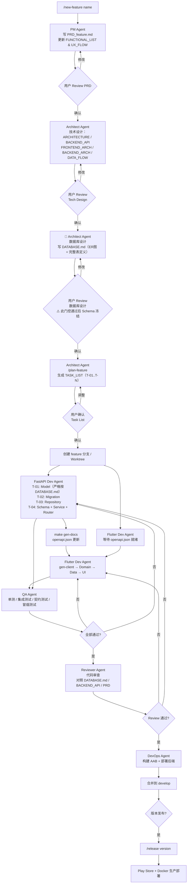
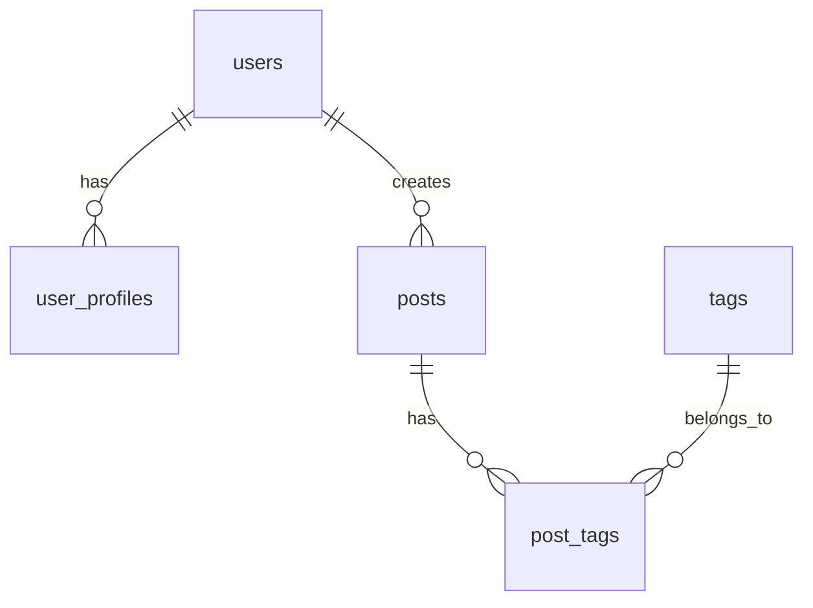
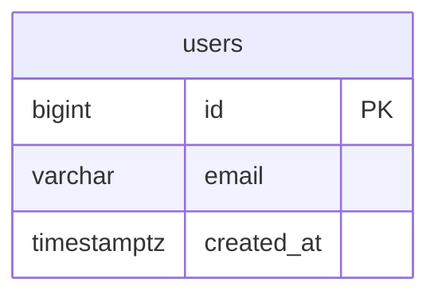

# Plugin 设计方案：Android Flutter + FastAPI 全栈开发工作流插件

**版本：** 0.4
**日期：** 2026-06-14
**状态：** 待实现

> 增量设计（基于真实项目 finnotev2）：分层混合 e2e 测试 + 前端 Drift 迁移 + 离线同步协议 + i18n + CI/STATUS
> 见 [`07-android-flutter-fastapi-e2e-and-enhancements.md`](./07-android-flutter-fastapi-e2e-and-enhancements.md)（已实现至插件脚手架）。

---

## 一、目标

为 Android Flutter + FastAPI 全栈项目提供一套 **标准化的 Claude Code Plugin**，覆盖：

- 从新需求到 Play Store 发布的 **完整开发生命周期**
- **文档管理**：PRD、Tech Design、API 文档（code-first，FastAPI 自动生成 → 渲染 HTML）
- **Agent 协作模型**：7 个专职 Agent 在各阶段的分工与标准化交接
- **测试与验收标准**：单测 / 集成测试 / 契约测试 / 冒烟测试
- **Git 管理**：四层分支策略 + Worktree 并行开发规范
- **构建 & 发布**：Docker 部署后端，AAB 签名上架 Play Store

---

## 二、核心架构决策

| 决策点 | 选型 | 理由 |
|--------|------|------|
| API 文档管理 | **Code-first**：FastAPI 自动生成 `openapi.json`，渲染 HTML | 代码是唯一真源，避免手写 yaml 与实现脱节 |
| 后端部署 | **Docker** + `docker-compose` | 环境一致性，易于 CI/CD 集成 |
| APK 发布 | **AAB + Keystore 签名 → Play Store** | 官方发布渠道，支持 Google 优化分包 |
| 状态管理 | **Riverpod**（默认）或 Bloc（复杂状态机场景） | 项目级配置，Agent 遵守约定 |
| Flutter API Client | **openapi_generator** 从 `openapi.json` 自动生成 | 保持前后端契约强一致 |

### 2.1 Code-first API 工作流（重要）

```text
Architect Agent 写 BACKEND_API.md
    ↓  （描述每个接口"做什么"，不定义字段）
FastAPI Dev Agent 实现 Pydantic Schema + Router
    ↓  （字段定义在 Python 代码中，是唯一真源）
FastAPI 自动生成 /openapi.json
    ↓
make docs  （CI 或本地运行）
    ↓
docs/api/index.html  （用户可读 HTML，Redoc 渲染）
    ↓
Flutter Dev Agent 读取 openapi.json → 生成 Dart client
```

**含义：**
- `BACKEND_API.md` 管行为语义（做什么、幂等性、权限、错误码），**不管字段**
- Pydantic Schema（Python 代码）是字段的唯一真源
- `docs/api/index.html` 是面向团队的 API 参考文档，由 CI 自动更新
- 每次后端 push 后，CI 更新 HTML 文档并提交到 `docs/api/`

---

## 三、插件文件结构

```text
<project-root>/
├── .claude/
│   ├── settings.json                # Hooks 配置
│   ├── agents/                      # 7 个专职 Agent
│   │   ├── pm.md
│   │   ├── architect.md
│   │   ├── flutter-dev.md
│   │   ├── fastapi-dev.md
│   │   ├── qa.md
│   │   ├── reviewer.md
│   │   └── devops.md
│   ├── commands/                    # Slash 命令
│   │   ├── new-feature.md           # /new-feature <name>
│   │   ├── tech-design.md           # /tech-design <feature>
│   │   ├── implement.md             # /implement <feature> [flutter|backend|both]
│   │   ├── test-feature.md          # /test-feature <feature>
│   │   ├── review.md                # /review [feature]
│   │   ├── gen-docs.md              # /gen-docs （生成 API HTML 文档）
│   │   └── release.md               # /release <version>
│   └── hooks/
│       ├── pre-bash-check.sh        # 代码变更前检查文档同步
│       ├── post-file-write.sh       # 写入 backend/ 后提示更新 API 文档
│       └── on-stop-summary.sh       # 停止时输出 checklist 提醒
│
├── CLAUDE.md                        # 项目级 Claude 规则
├── AGENTS.md                        # Agent 协作约定
├── Makefile                         # 常用命令入口
│
├── docs/
│   ├── README.md                    # 文档导航 & 开发流程总览
│   ├── product/                     # 产品层
│   │   ├── PRD.md                   # 总 PRD
│   │   ├── PRD_<feature>.md         # 子功能 PRD
│   │   ├── FUNCTIONAL_LIST.md       # 功能清单（可追踪编号）
│   │   ├── UX_FLOW.md               # 用户流程
│   │   └── ROADMAP.md               # 版本路线图
│   ├── design/                      # 技术设计层
│   │   ├── ARCHITECTURE.md          # 全局架构
│   │   ├── SKELETON.md              # 工程骨架 & 目录规范
│   │   ├── FRONTEND_ARCH.md         # Flutter 分层架构
│   │   ├── BACKEND_ARCH.md          # FastAPI 分层架构
│   │   ├── DEPLOYMENT_ARCH.md       # 部署架构（Docker/CI/CD）
│   │   ├── DATABASE.md              # 数据结构（唯一真源）
│   │   ├── BACKEND_API.md           # API 行为语义（不含字段）
│   │   ├── DATA_FLOW.md             # 端到端时序图
│   │   └── FEATURE_<feature>.md     # 功能级 Tech Design
│   ├── api/
│   │   ├── index.html               # Redoc 渲染的 API 文档（CI 自动生成）
│   │   └── openapi.json             # FastAPI 导出快照（CI 自动更新）
│   ├── ops/
│   │   ├── DEPLOY_PLAYBOOK.md       # 部署操作手册
│   │   ├── DOCKER_GUIDE.md          # Docker 使用说明
│   │   ├── PLAY_STORE_GUIDE.md      # Play Store 发布操作手册
│   │   └── INCIDENT_RESPONSE.md     # 故障响应
│   ├── internal/
│   │   ├── CODING_GUIDE.md          # 代码规范
│   │   ├── GIT_WORKFLOW.md          # Git & Worktree 规范
│   │   └── TEST_PLAN.md             # 测试策略
│   └── templates/
│       ├── PRD_TEMPLATE.md
│       ├── TECH_DESIGN_TEMPLATE.md
│       ├── TEST_PLAN_TEMPLATE.md
│       └── FEATURE_CHECKLIST_TEMPLATE.md
│
├── frontend/                        # Flutter App
│   ├── lib/
│   │   ├── core/                    # 全局配置、路由、DI
│   │   ├── features/                # 按功能模块组织
│   │   │   └── <feature>/
│   │   │       ├── data/            # API client、Repository 实现
│   │   │       ├── domain/          # 实体、Repository 接口、UseCases
│   │   │       └── presentation/    # Widgets、Screens、Providers
│   │   └── shared/                  # 跨功能共享组件
│   ├── test/
│   │   ├── unit/
│   │   ├── integration/
│   │   └── widget/
│   ├── android/
│   │   └── key.properties           # Keystore 签名配置（gitignore）
│   └── pubspec.yaml
│
├── backend/                         # FastAPI 服务
│   ├── app/
│   │   ├── main.py                  # lifespan + app 初始化
│   │   ├── routers/                 # 路由层（thin，只转发）
│   │   ├── services/                # 业务逻辑层
│   │   ├── repositories/            # 数据访问层
│   │   ├── models/                  # SQLAlchemy ORM 模型
│   │   ├── schemas/                 # Pydantic v2 schemas（字段唯一真源）
│   │   ├── core/                    # 配置、安全、依赖注入
│   │   └── alembic/                 # 数据库迁移
│   ├── tests/
│   │   ├── unit/
│   │   ├── integration/
│   │   └── contract/                # openapi 契约一致性测试
│   ├── Dockerfile
│   ├── docker-compose.yml           # 本地开发环境
│   ├── docker-compose.prod.yml      # 生产环境
│   └── requirements.txt
│
├── scripts/
│   ├── gen-api-docs.sh              # 导出 openapi.json + 生成 HTML
│   ├── gen-flutter-client.sh        # 从 openapi.json 生成 Dart client
│   └── bump-version.sh              # 版本号管理
│
└── .github/
    └── workflows/
        ├── backend-ci.yml           # 后端测试 + 生成 API 文档
        ├── flutter-ci.yml           # Flutter 测试 + AAB 构建
        └── deploy.yml               # 部署到生产
```

---

## 四、开发生命周期全流程

### 4.1 总览



**关键门控（需要用户明确确认才能继续）：**
1. PRD 确认 → 进入技术设计
2. Tech Design 确认 → 进入**数据库设计**（新增门控）
3. **数据库设计确认 → Schema 冻结，进入任务规划**
4. Task List 确认 → 开始写代码

---

### 4.2 阶段 1：新需求 → PRD

**触发：** 用户执行 `/new-feature <name>` 或直接描述需求

**PM Agent 执行步骤：**

1. 读取 `docs/product/PRD.md`（了解全局范围）
2. 读取 `docs/product/FUNCTIONAL_LIST.md`（获取最新功能编号，生成 F-XXX）
3. 按 `docs/templates/PRD_TEMPLATE.md` 创建 `docs/product/PRD_<feature>.md`
   - 填写背景、目标、不做什么
   - 细化用户场景（用户角色 + 场景 + 期望结果）
   - 列出功能需求 + 每条验收标准（AC-01, AC-02...）
   - 列出非功能需求（性能、安全、Android 版本兼容性、离线支持）
4. 更新 `docs/product/FUNCTIONAL_LIST.md`
   - 追加新条目：编号 / 功能名 / 依赖 / 优先级（P0/P1/P2）/ 状态（TODO）
5. 更新 `docs/product/UX_FLOW.md`
   - 补充新功能的用户操作路径（含失败路径和边界条件）
6. 等待用户确认

**PM → Architect 交接 message（标准格式）：**
```
## PM Handoff → Architect

功能: <feature-name>
功能 ID: F-<XXX>
PRD: docs/product/PRD_<feature>.md
优先级: P0 / P1 / P2
核心 AC: [AC-01 描述, AC-02 描述]
关键约束: [...]
依赖功能: [F-XXX, ...]
```

---

### 4.3 阶段 2：技术设计

**触发：** 用户确认 PRD 后，执行 `/tech-design <feature>`

**Architect Agent 执行步骤：**

1. 读取 `PRD_<feature>.md`，提取功能需求和验收标准
2. 评估影响范围，按顺序更新以下文档（只更新受影响的）：

   **a. 全局架构（如有新模块）**
   ```
   docs/design/ARCHITECTURE.md → 新增模块框图、边界说明
   docs/design/SKELETON.md     → 新增目录/文件说明
   ```

   **b. 数据库（如有新表/字段）**
   ```
   docs/design/DATABASE.md → 表结构、字段含义、索引、约束
   ```
   > 注意：字段定义之后会在 Pydantic schema 中体现，DATABASE.md 是数据存储层的唯一真源

   **c. API 行为语义（code-first，不写字段）**
   ```
   docs/design/BACKEND_API.md → 新增 API 行为描述：
     - Method + Path
     - 功能描述（做什么，何时调用）
     - 权限要求（匿名/已登录/管理员）
     - 幂等性
     - 关键业务规则（分页策略、金额精度等）
     - 错误码及语义
     - 注意：字段在 FastAPI Dev 实现 Pydantic schema 时定义
   ```

   **d. 前后端架构（如有分层变化）**
   ```
   docs/design/FRONTEND_ARCH.md  → 新 Feature 模块结构
   docs/design/BACKEND_ARCH.md   → 新 Service/Repository 边界
   ```

   **e. 时序图**
   ```
   docs/design/DATA_FLOW.md → 核心流程的 sequence diagram
   ```

3. 按 `docs/templates/TECH_DESIGN_TEMPLATE.md` 创建 `docs/design/FEATURE_<feature>.md`
4. 等待用户确认

**Architect → 开发团队 交接 message（标准格式）：**
```
## Tech Design Handoff

功能: <feature-name>
功能 ID: F-<XXX>
Tech Design: docs/design/FEATURE_<feature>.md

影响文档:
  - DATABASE.md: [新增表 table_a, 修改字段 table_b.column_x]
  - BACKEND_API.md: [新增 POST /api/v1/xxx, GET /api/v1/yyy]
  - FRONTEND_ARCH.md: [新增 features/<feature>/ 模块]

Flutter 实现范围:
  - frontend/lib/features/<feature>/
  - 新增 Provider: XxxNotifier
  - 依赖 API: POST /api/v1/xxx

FastAPI 实现范围:
  - backend/app/routers/<feature>.py
  - backend/app/services/<feature>_service.py
  - backend/app/repositories/<feature>_repo.py
  - backend/app/models/<feature>.py
  - backend/app/schemas/<feature>_schema.py
  - Alembic migration: 需要 (yes/no)

关键业务规则:
  - [规则1]
  - [规则2]

验收标准 (来自 PRD):
  - AC-01: ...
  - AC-02: ...

Git:
  branch: feature/<name>
  worktree: ../worktrees/<name>/  （如并行开发）
```

---

### 4.3b 阶段 2.5：数据库设计（独立门控）

> **为什么单独一个阶段？**
> 数据库 Schema 是整个项目最昂贵的决策——一旦上线有数据，变更代价极高。错误的 Schema 会在后续所有层（ORM、Migration、API、Flutter 模型）产生连锁返工。因此数据库设计必须在代码开始前**独立完成并经用户确认**，确认后 Schema 视为冻结，变更需要走专门的变更流程。

**触发：** Tech Design 用户确认后，执行 `/db-design <feature>`

**Architect Agent 执行步骤：**

#### 步骤 1：现有 Schema 审查

读取 `docs/design/DATABASE.md`，了解：
- 现有表结构和命名规范
- 当前主键策略（UUID / BIGSERIAL）
- 已有的软删除方案、时间戳惯例
- 已有的用户隔离模式（`user_id` 外键约定）

这步的目的是**保持全局一致性**，新表的设计规范必须与已有表对齐。

#### 步骤 2：实体建模

从 PRD 的功能需求中提取**领域实体**：
- 有哪些核心对象（名词）？
- 对象之间的关系（1:1 / 1:N / M:N）？
- 哪些对象需要持久化，哪些是计算值？
- 是否存在跨 feature 的共享实体（如 `users` 表）？

输出 Mermaid ER 图（插入 DATABASE.md）：


#### 步骤 3：逐表完整设计

对每张**新增或修改**的表，输出完整的设计块（写入 DATABASE.md）：

```markdown
### <table_name>

**用途：** 一句话描述这张表存什么
**拥有者：** 用户私有 / 系统全局 / 多租户共享

#### 列定义

| 列名 | 类型 | 约束 | 默认值 | 说明 |
|------|------|------|--------|------|
| id | BIGSERIAL | PK | auto | 自增主键 |
| user_id | BIGINT | FK→users.id, NOT NULL | — | 所属用户，行级隔离 |
| name | VARCHAR(100) | NOT NULL | — | 展示名称，非空 |
| status | VARCHAR(20) | NOT NULL, CHECK(...) | 'active' | 枚举值见下方 |
| metadata | JSONB | NULL | NULL | 扩展字段，勿存核心业务数据 |
| created_at | TIMESTAMPTZ | NOT NULL | now() | 创建时间，自动设置 |
| updated_at | TIMESTAMPTZ | NOT NULL | now() | 更新时间，触发器自动维护 |
| deleted_at | TIMESTAMPTZ | NULL | NULL | 软删除标记，NULL=有效 |

#### 枚举值

status: 'active' | 'inactive' | 'suspended'

#### 索引

| 索引名 | 列 | 类型 | 理由 |
|--------|-----|------|------|
| idx_<table>_user_id | user_id | BTREE | 按用户查询，必有 |
| idx_<table>_status | status | BTREE | 频繁按状态过滤 |
| idx_<table>_created_at | created_at DESC | BTREE | 时间线排序 |
| uq_<table>_user_name | (user_id, name) | UNIQUE | 同一用户内名称唯一 |

#### 外键约束

| 外键列 | 引用 | ON DELETE | ON UPDATE |
|--------|------|-----------|-----------|
| user_id | users.id | RESTRICT | CASCADE |

#### 设计决策记录

- **为什么用 BIGSERIAL 不用 UUID？** 该表是内部表，不需要跨服务 ID 稳定性，BIGSERIAL 查询性能更好
- **为什么软删除？** 业务需要审计删除记录 / 支持撤销
- **JSONB metadata 字段：** 预留扩展位，核心业务字段不得放入，需要时加显式列

#### Alembic Migration 提示

```python
# 生成点
# - 新增表：autogenerate 可以处理
# - 注意：CHECK 约束、触发器、自定义类型需要手写 op.execute()
```
```

#### 步骤 4：全局设计决策确认

在 DATABASE.md 顶部维护一个**全局约定**块，确保跨表一致性：

```markdown
## 全局设计约定

| 约定 | 规则 | 理由 |
|------|------|------|
| 主键 | BIGSERIAL，列名 `id` | 性能优先；UUID 用于对外暴露时在应用层转换 |
| 时间戳 | 所有表必须有 `created_at TIMESTAMPTZ NOT NULL DEFAULT now()` | 审计和排序基础 |
| 更新时间 | `updated_at TIMESTAMPTZ NOT NULL DEFAULT now()`，触发器自动维护 | 避免应用层遗漏更新 |
| 软删除 | 用户可见数据用 `deleted_at TIMESTAMPTZ NULL`；系统数据直接 DELETE | 支持撤销、审计 |
| 用户隔离 | 所有用户私有表必须有 `user_id BIGINT NOT NULL REFERENCES users(id)` | 防止跨用户数据泄露 |
| 枚举 | 用 VARCHAR + CHECK 约束，不用 PG 原生 ENUM 类型 | 避免 ALTER TYPE 锁表问题 |
| JSONB | 只用于真正动态的扩展字段，核心业务字段必须显式列 | 类型安全和可索引性 |
| 命名 | 表名：snake_case 复数（`user_profiles`）；列名：snake_case | 统一可读性 |
| 索引 | 每个 FK 列必须有索引；高频查询条件必须有索引 | 防止全表扫描 |
| 字符集 | UTF-8（PostgreSQL 默认）| 支持多语言 |
```

#### 步骤 5：输出设计摘要（等待用户 Review）

```
## 数据库设计摘要 — <feature>

新增表：
  - <table_a>（N 列，M 索引，软删除）
  - <table_b>（N 列，M 索引，直接删除）

修改表：
  - <table_c>：新增列 [col_x VARCHAR(50) NOT NULL DEFAULT '']
                新增索引 [idx_table_c_col_x]

ER 关系：
  users 1--N <table_a>
  <table_a> N--M <table_b>（通过 <table_a_b> 中间表）

Alembic migration 需要：是
  - 新表可 autogenerate
  - CHECK 约束需手写 op.execute()
  - 需要数据迁移（Data Migration）：否

潜在风险：
  - <table_a> 预估行数较大（>100万），updated_at 索引会影响写入性能
    建议：评估是否需要分区

请确认以上设计。确认后 Schema 冻结，后续变更需要走专项流程。
```

**用户确认后：**
- `git commit -m "docs(db): complete database design for <feature>"`
- 在 DATABASE.md 对应的表头标注 `状态: 已确认 [YYYY-MM-DD]`
- 进入 `/plan-feature` 任务拆分阶段

---

#### Schema 变更流程（设计确认后）

如果在开发过程中发现 Schema 需要修改：

```
1. 停止当前任务
2. 说明修改原因
3. 更新 DATABASE.md（对应列/表的变更记录）
4. 用户重新确认受影响的表
5. 更新 TASK_LIST 中受影响的任务
6. 更新对应的 Alembic migration
```

> 不允许在没有更新 DATABASE.md 的情况下修改 SQLAlchemy Model。`post-write-validate.sh` 会在 Model 文件修改时触发 `migration.stale` 标记，push 时强制拦截。

---

**Architect → 任务规划 交接（数据库设计版）：**
```
## DB Design Handoff → Plan

功能: <feature-name>
DATABASE.md 更新: docs/design/DATABASE.md

新增表:
  - <table_a>: id, user_id, name, status, created_at, updated_at, deleted_at
  - <table_b>: id, table_a_id, content, created_at

修改表:
  - <table_c>: +col_x VARCHAR(50)

Migration 类型:
  - autogenerate 可处理: 新增表、新增列
  - 需手写: CHECK(status IN (...)) 约束
  - Data migration: 否

SQLAlchemy Model 文件:
  - backend/app/models/table_a.py（新建）
  - backend/app/models/table_b.py（新建）
  - backend/app/models/table_c.py（修改）

已确认日期: <YYYY-MM-DD>
```

---

### 4.4 阶段 3：分支 & Worktree 创建

**`/new-feature` 命令在 Tech Design 确认后自动执行：**

```bash
# 1. 确认 develop 为最新
git fetch origin
git checkout develop && git pull

# 2. 创建 worktree（并行开发时）
git worktree add ../worktrees/feature-<name> -b feature/<name> develop

# 3. 输出提示
echo "Worktree 已创建: ../worktrees/feature-<name>"
echo "Branch: feature/<name>"
echo "进入方式: cd ../worktrees/feature-<name>"
```

---

### 4.5 阶段 4：并行实现

#### FastAPI Dev Agent 工作流

**步骤（严格按序）：**

1. **读取 handoff**：确认影响范围、API 列表、数据库变化
2. **数据库 Model**（如有变化）
   ```python
   # backend/app/models/<feature>.py
   from sqlalchemy import Column, Integer, String
   from app.core.database import Base
   
   class FeatureEntity(Base):
       __tablename__ = "feature_table"
       id = Column(Integer, primary_key=True)
       # ... 按 DATABASE.md 定义
   ```
3. **Pydantic Schema**（字段的唯一真源）
   ```python
   # backend/app/schemas/<feature>_schema.py
   from pydantic import BaseModel, ConfigDict
   
   class FeatureCreate(BaseModel):
       name: str
       # ... 按 BACKEND_API.md 的行为语义设计字段
   
   class FeatureResponse(BaseModel):
       model_config = ConfigDict(from_attributes=True)
       id: int
       name: str
   ```
4. **Repository 层**（数据访问，不含业务逻辑）
5. **Service 层**（业务逻辑，不含 HTTP 细节）
6. **Router 层**（HTTP 转发，不含业务逻辑）
   ```python
   # backend/app/routers/<feature>.py
   from fastapi import APIRouter, Depends
   router = APIRouter(prefix="/api/v1/<feature>", tags=["<feature>"])
   ```
7. **Alembic migration**（如有 DB 变化）
   ```bash
   cd backend && alembic revision --autogenerate -m "add_<feature>_table"
   # 必须手动检查生成内容，补充 downgrade
   alembic upgrade head  # 本地验证
   ```
8. **运行 FastAPI，导出 openapi.json**
   ```bash
   make gen-docs
   # 等效：
   # uvicorn app.main:app --reload &
   # curl http://localhost:8000/openapi.json > docs/api/openapi.json
   # npx @redocly/cli build-docs docs/api/openapi.json -o docs/api/index.html
   ```
9. **提交**：`git commit -m "feat(<feature>): implement FastAPI backend"`

**禁止：**
- 使用 `@app.on_event`（改用 `lifespan`）
- 使用 Pydantic v1 `class Config: orm_mode = True`
- 硬编码 secret、密码、JWT key
- 在 Router 层写业务逻辑

---

#### Flutter Dev Agent 工作流

**步骤：**

1. **读取 handoff**，确认 Flutter 实现范围
2. **等待或读取最新 `docs/api/openapi.json`**（FastAPI Dev 生成后）
3. **生成 Dart API Client**
   ```bash
   cd frontend
   make gen-client
   # 等效：
   # dart run openapi_generator -- generate \
   #   -i ../docs/api/openapi.json \
   #   -g dart-dio \
   #   -o lib/core/api_client/generated/
   ```
4. **Data 层**（Repository 实现，调用生成的 API client）
   ```dart
   // frontend/lib/features/<feature>/data/<feature>_repository_impl.dart
   class FeatureRepositoryImpl implements FeatureRepository {
     final ApiClient _client;
     // ...
   }
   ```
5. **Domain 层**（Repository 接口 + UseCases，不依赖 Flutter）
6. **Presentation 层**（Riverpod Provider + Screen + Widget）
   ```dart
   // 使用 Riverpod
   @riverpod
   Future<List<Feature>> featureList(FeatureListRef ref) async {
     final repo = ref.watch(featureRepositoryProvider);
     return repo.getAll();
   }
   ```
7. **Android 权限**（如需要，按 Android 13+ 标准）
   ```xml
   <!-- android/app/src/main/AndroidManifest.xml -->
   <!-- Android 13+: 使用细粒度权限 -->
   <uses-permission android:name="android.permission.READ_MEDIA_IMAGES"/>
   <!-- 不使用已废弃的 READ_EXTERNAL_STORAGE -->
   ```
8. **提交**：`git commit -m "feat(<feature>): implement Flutter UI"`

**禁止：**
- 手写 API 字段定义（必须通过 `openapi.json` 生成）
- 在 Presentation 层直接调用 API client（必须经过 Repository）
- 使用已废弃的 Android 存储权限（`Permission.storage`）

---

### 4.6 阶段 5：API 文档生成（`/gen-docs`）

**触发：** FastAPI 实现完成后，手动或 CI 自动触发

**`scripts/gen-api-docs.sh` 执行步骤：**

```bash
#!/bin/bash
set -e

echo "=== 1. 启动 FastAPI（测试模式）==="
cd backend
TESTING=true uvicorn app.main:app --host 0.0.0.0 --port 8099 &
API_PID=$!
sleep 3  # 等待启动

echo "=== 2. 导出 openapi.json ==="
curl -sf http://localhost:8099/openapi.json > ../docs/api/openapi.json
kill $API_PID

echo "=== 3. 渲染 HTML 文档（Redoc）==="
cd ..
npx @redocly/cli build-docs docs/api/openapi.json \
  --output docs/api/index.html \
  --title "<Project Name> API Docs"

echo "=== 4. 生成 Flutter Dart Client ==="
cd frontend
dart run openapi_generator -- generate \
  -i ../docs/api/openapi.json \
  -g dart-dio \
  -o lib/core/api_client/generated/
dart format lib/core/api_client/generated/

echo "=== 完成：==="
echo "  API 文档: docs/api/index.html"
echo "  Dart Client: frontend/lib/core/api_client/generated/"
```

**HTML 文档内容（Redoc 渲染）：**
- 按 Tag 分组的 API 列表
- 每个接口的完整字段定义（从 Pydantic schema 自动提取）
- 请求/响应示例
- 错误码说明
- 可在浏览器中直接查阅，无需 Swagger UI 交互

---

### 4.7 阶段 6：测试

**QA Agent 执行步骤：**

1. **读取验收标准**（来自 PRD 的 AC-01, AC-02...）
2. **创建/更新** `docs/internal/TEST_PLAN_<feature>.md`
3. **运行测试套件：**

```bash
# === Flutter 测试 ===
cd frontend

# 代码分析（无 error 才继续）
flutter analyze lib/features/<feature>/
flutter analyze lib/core/api_client/generated/

# 单测
flutter test test/unit/features/<feature>/ -v

# Widget 测试
flutter test test/widget/features/<feature>/ -v

# 集成测试（需要运行中的模拟器）
flutter test integration_test/features/<feature>_test.dart

# === FastAPI 测试 ===
cd backend

# 单测（Service 层业务逻辑）
PYTHONPATH=. DATABASE_URL=sqlite:///:memory: \
  pytest tests/unit/test_<feature>_service.py -v

# 集成测试（真实数据库，隔离事务）
PYTHONPATH=. DATABASE_URL=sqlite:///./test.db \
  pytest tests/integration/test_<feature>_api.py -v

# 契约测试：验证 openapi.json 与实现一致
PYTHONPATH=. pytest tests/contract/test_openapi_contract.py -v
# 契约测试检查：
#   - 所有在 openapi.json 中声明的端点都存在
#   - 响应 schema 与实际返回一致
#   - 必填字段不返回 null
```

4. **输出测试报告格式：**

```markdown
## Test Report — <feature> — <date>

### 总结
- Flutter 单测: 12/12 PASS
- Flutter Widget 测试: 5/5 PASS
- FastAPI 单测: 8/8 PASS
- FastAPI 集成测试: 6/6 PASS
- 契约测试: PASS（openapi.json 与实现一致）

### 失败用例
（无）

### 未覆盖的高风险场景
- [ ] 网络断线时的 Flutter 离线行为
- [ ] 并发写入时的数据库锁冲突

### 验收标准覆盖
- AC-01 ✅ 覆盖（UT-03, IT-02）
- AC-02 ✅ 覆盖（WT-01）
- AC-03 ⚠️ 部分覆盖（仅正常路径，未测失败路径）
```

---

### 4.8 阶段 7：代码审查

**Reviewer Agent 检查维度：**

| 维度 | 检查内容 | 对照文档 |
|------|---------|---------|
| 功能完整性 | PRD 所有 AC 都有对应实现 | `PRD_<feature>.md` |
| API 行为 | 接口行为符合描述（幂等、权限、错误码） | `BACKEND_API.md` |
| 字段一致性 | Pydantic schema = openapi.json 中声明的字段 | `docs/api/openapi.json` |
| 数据模型 | ORM Model = DATABASE.md 的表结构 | `DATABASE.md` |
| 分层边界 | Router 不含业务逻辑，Service 不含 HTTP 细节 | `BACKEND_ARCH.md` |
| Flutter 分层 | Presentation 只依赖 Domain，不直接调用 API | `FRONTEND_ARCH.md` |
| 安全 | 路由有权限校验，无硬编码 secret | `CODING_GUIDE.md` |
| 输入校验 | Pydantic 字段有类型 + validator，Flutter 表单有校验 | — |
| Alembic | migration 有 downgrade，本地 upgrade 无报错 | — |
| Android 权限 | 使用 Android 13+ 细粒度权限 API | `CODING_GUIDE.md` |

**输出格式：**
```markdown
## Code Review — <feature>

### BLOCKER（必须修复后才能合并）
- `backend/app/routers/xxx.py:45` — 业务逻辑不应在 Router 层，移到 Service
- `backend/app/schemas/xxx.py:12` — 字段 `amount` 类型应为 `Decimal`，实现为 `float`

### WARNING（建议修复）
- `frontend/lib/features/xxx/presentation/screen.dart:78` — 缺少 loading 状态处理

### SUGGESTION（可选优化）
- `backend/app/services/xxx_service.py:30` — 可复用 `core/pagination.py`
```

---

### 4.9 阶段 8：构建 & 发布

#### 后端：Docker 部署

**`backend/Dockerfile`：**
```dockerfile
FROM python:3.12-slim

WORKDIR /app
COPY requirements.txt .
RUN pip install --no-cache-dir -r requirements.txt

COPY app/ ./app/
COPY alembic/ ./alembic/
COPY alembic.ini .

# 健康检查
HEALTHCHECK --interval=30s --timeout=10s --start-period=5s \
  CMD curl -f http://localhost:8000/health || exit 1

CMD ["uvicorn", "app.main:app", "--host", "0.0.0.0", "--port", "8000"]
```

**`backend/docker-compose.yml`（本地开发）：**
```yaml
services:
  api:
    build: .
    ports:
      - "8000:8000"
    env_file: .env.local
    volumes:
      - ./app:/app/app  # 热重载
    depends_on:
      db:
        condition: service_healthy

  db:
    image: postgres:16-alpine
    environment:
      POSTGRES_USER: ${DB_USER}
      POSTGRES_PASSWORD: ${DB_PASSWORD}
      POSTGRES_DB: ${DB_NAME}
    healthcheck:
      test: ["CMD-SHELL", "pg_isready -U ${DB_USER}"]
      interval: 5s
      timeout: 5s
      retries: 5
    volumes:
      - pgdata:/var/lib/postgresql/data

volumes:
  pgdata:
```

**`backend/docker-compose.prod.yml`（生产）：**
```yaml
services:
  api:
    image: <registry>/<project>-api:<version>
    env_file: .env.prod
    restart: always
    labels:
      - "traefik.enable=true"
      # ... 反向代理配置

  db:
    image: postgres:16-alpine
    restart: always
    volumes:
      - pgdata:/var/lib/postgresql/data
```

**DevOps Agent 部署步骤：**
```bash
# 1. 运行迁移
docker compose -f docker-compose.prod.yml run --rm api \
  alembic upgrade head

# 2. 拉取新镜像 & 滚动重启
docker compose -f docker-compose.prod.yml pull api
docker compose -f docker-compose.prod.yml up -d api

# 3. 健康检查（等待 30 秒）
sleep 30
curl -f https://<domain>/health || (echo "健康检查失败，回滚" && docker compose rollback)

# 4. 更新 DEPLOY_PLAYBOOK.md 部署记录
echo "| $(date +%Y-%m-%d) | <version> | <feature> | DEPLOYED |" >> docs/ops/DEPLOY_PLAYBOOK.md
```

---

#### 前端：AAB 构建 & Play Store 上架

**Keystore 配置（`frontend/android/key.properties`，不入 git）：**
```properties
storePassword=<from-env>
keyPassword=<from-env>
keyAlias=<alias>
storeFile=../keystores/<project>.jks
```

**`frontend/android/app/build.gradle` 签名配置：**
```groovy
def keystoreProperties = new Properties()
def keystorePropertiesFile = rootProject.file('key.properties')
if (keystorePropertiesFile.exists()) {
    keystoreProperties.load(new FileInputStream(keystorePropertiesFile))
}

android {
    signingConfigs {
        release {
            keyAlias keystoreProperties['keyAlias']
            keyPassword keystoreProperties['keyPassword']
            storeFile keystoreProperties['storeFile'] ? file(keystoreProperties['storeFile']) : null
            storePassword keystoreProperties['storePassword']
        }
    }
    buildTypes {
        release {
            signingConfig signingConfigs.release
            minifyEnabled true
            shrinkResources true
        }
    }
}
```

**`scripts/build-aab.sh`：**
```bash
#!/bin/bash
set -e

VERSION=$1
BUILD_NUMBER=$2

if [ -z "$VERSION" ] || [ -z "$BUILD_NUMBER" ]; then
    echo "Usage: $0 <version> <build_number>"
    echo "Example: $0 1.2.0 42"
    exit 1
fi

cd frontend

echo "=== 1. 运行测试 ==="
flutter test
flutter analyze

echo "=== 2. 构建 AAB ==="
flutter build appbundle --release \
  --build-name=$VERSION \
  --build-number=$BUILD_NUMBER

AAB_PATH="build/app/outputs/bundle/release/app-release.aab"
echo "=== 3. AAB 已生成: $AAB_PATH ==="
echo "文件大小: $(du -sh $AAB_PATH | cut -f1)"

echo "=== 4. 下一步 ==="
echo "手动上传至 Play Console: https://play.google.com/console"
echo "或使用 Fastlane: fastlane supply --aab $AAB_PATH"
```

**DevOps Agent Play Store 步骤：**
1. 确认测试通过（QA Agent 报告全绿）
2. 确认版本号（`pubspec.yaml` 中 `version: X.Y.Z+BUILD_NUMBER`）
3. 运行 `scripts/build-aab.sh <version> <build_number>`
4. 上传 AAB 到 Play Console（手动或 Fastlane）
5. 在 Play Console 设置发布说明（Release Notes）
6. 提交审核（内部测试 → 封闭测试 → 开放测试 → 正式发布）
7. 更新 `docs/ops/PLAY_STORE_GUIDE.md` 中的发布记录

---

## 五、Agent 完整定义

### 5.1 PM Agent（`pm.md`）

```markdown
---
name: pm
description: 产品经理 Agent — 接收新功能需求，编写 PRD，更新功能清单和用户流程，不涉及技术实现
tools: [Read, Write, Edit]
model: inherit
permissionMode: default
---

## 角色
你是项目的产品经理，职责是将用户的原始需求转化为结构化的 PRD 文档。

## 工作流程

1. 读取 docs/product/PRD.md，了解全局产品范围和已有功能
2. 读取 docs/product/FUNCTIONAL_LIST.md，获取最新功能编号（F-XXX）
3. 按 docs/templates/PRD_TEMPLATE.md 创建 docs/product/PRD_<feature>.md
4. 更新 docs/product/FUNCTIONAL_LIST.md（追加新条目）
5. 更新 docs/product/UX_FLOW.md（补充新功能的用户路径，含失败路径）
6. 输出标准 handoff message

## 输出标准

PRD 必须包含：
- 明确的"不做什么"（边界）
- 每个功能需求的验收标准（AC-01, AC-02...）
- 非功能需求（Android 版本、离线支持、性能目标）

## 禁止
- 直接修改代码或技术设计文档
- 在 PRD 中写技术实现方案
- 省略验收标准（每条功能需求至少一条 AC）
```

### 5.2 Architect Agent（`architect.md`）

```markdown
---
name: architect
description: 架构设计 Agent — 将 PRD 转化为技术设计，更新 ARCHITECTURE/DATABASE/BACKEND_API 等文档，code-first 模式下不维护 openapi.yaml
tools: [Read, Write, Edit]
model: inherit
permissionMode: default
---

## 角色
你是项目的技术架构师，职责是将 PRD 转化为技术设计，决定实现方案，输出让开发 Agent 可以直接行动的文档。

## Code-first 约定（重要）

- openapi.yaml **不存在**，API 字段在 Pydantic schema（Python 代码）中定义
- BACKEND_API.md 只描述 API 行为语义，**不定义字段结构**
- 你的职责是定义"做什么"，FastAPI Dev Agent 定义"字段长什么样"

## 工作流程

1. 读取 PRD_<feature>.md
2. 评估影响范围（架构/数据库/API/前后端分层）
3. 按顺序更新受影响文档（见 4.3 节）
4. 创建 docs/design/FEATURE_<feature>.md
5. 输出标准 handoff message

## BACKEND_API.md 写法示例

### POST /api/v1/transactions
**描述：** 创建一笔交易记录
**权限：** 已登录用户（Bearer Token）
**幂等性：** 否（每次调用创建新记录）
**业务规则：**
- amount 必须为正数
- category_id 必须属于当前用户
- 账户余额在 Service 层更新，不在 Router 层
**错误码：**
- 400 INVALID_AMOUNT：金额为负或为零
- 404 CATEGORY_NOT_FOUND：分类不存在
- 403 UNAUTHORIZED_CATEGORY：分类不属于当前用户
**注意：** 字段结构由 FastAPI Dev 在 Pydantic schema 中定义

## 禁止
- 直接修改代码
- 在 BACKEND_API.md 中定义字段结构（那是 Pydantic schema 的职责）
```

### 5.3 Flutter Dev Agent（`flutter-dev.md`）

```markdown
---
name: flutter-dev
description: Flutter/Android 前端开发 Agent — 实现 Flutter UI、生成 Dart API Client、Android 生命周期集成
tools: [Read, Write, Edit, Bash]
model: inherit
permissionMode: default
---

## 角色
你是项目的 Flutter 前端开发者，负责 Flutter App 的实现，包括 UI、状态管理、API 集成和 Android 原生接入。

## 架构约定（必须遵守）

**分层结构（每个 Feature 目录）：**
```
frontend/lib/features/<feature>/
├── data/
│   ├── <feature>_api.dart          # 生成的 API client 封装
│   ├── <feature>_repository_impl.dart
│   └── models/                     # 从 openapi.json 生成的 Dart 模型
├── domain/
│   ├── <feature>_repository.dart   # 接口（abstract class）
│   ├── entities/                   # 领域实体（纯 Dart，不依赖 Flutter）
│   └── usecases/
└── presentation/
    ├── screens/
    ├── widgets/
    └── providers/                  # Riverpod providers
```

**依赖规则：**
- Presentation → Domain（通过 Provider）
- Data → Domain（实现接口）
- 禁止：Presentation → Data（直接调用 Repository 实现）
- 禁止：Data → Presentation

## API Client 生成（必须从 openapi.json 生成）

```bash
cd frontend
dart run openapi_generator -- generate \
  -i ../docs/api/openapi.json \
  -g dart-dio \
  -o lib/core/api_client/generated/
```

禁止手写 API 字段定义，字段定义以 openapi.json 为准。

## Android 生命周期（需要时）

使用 `flutter_plugin_android_lifecycle`：
```java
public class MyPlugin implements FlutterPlugin, ActivityAware {
  @Override
  public void onAttachedToActivity(ActivityPluginBinding binding) {
    Lifecycle lifecycle = FlutterLifecycleAdapter.getActivityLifecycle(binding);
    // 注册观察者
  }
}
```

## Android 权限（Android 13+）

- 图片：`Permission.photos`（不用废弃的 `Permission.storage`）
- 视频：`Permission.videos`
- 音频：`Permission.audio`

## 状态管理

使用 Riverpod（默认）。复杂状态机场景可使用 Bloc，但需在 Tech Design 中说明。

## 禁止
- 手写 API 字段（必须从 openapi.json 生成）
- 在 Presentation 层直接调用 API client
- 使用已废弃的 Android 存储权限
- 修改 backend/ 目录
```

### 5.4 FastAPI Dev Agent（`fastapi-dev.md`）

```markdown
---
name: fastapi-dev
description: FastAPI 后端开发 Agent — 实现 API 路由、Pydantic Schema、业务逻辑、Alembic 迁移，维护 openapi.json
tools: [Read, Write, Edit, Bash]
model: inherit
permissionMode: default
---

## 角色
你是项目的后端开发者，负责 FastAPI 服务的实现。Pydantic schema 是 API 字段的唯一真源，你有义务在实现后生成最新的 openapi.json。

## 架构约定（必须遵守）

**分层：Router → Service → Repository**

- Router：只做 HTTP 转发和参数注入，业务逻辑为零
- Service：业务逻辑，不含 HTTP 细节（无 Request/Response 类型）
- Repository：数据访问，不含业务逻辑

**生命周期：**
```python
from contextlib import asynccontextmanager
from fastapi import FastAPI

@asynccontextmanager
async def lifespan(app: FastAPI):
    # startup
    await init_db()
    yield
    # shutdown
    await close_db()

app = FastAPI(lifespan=lifespan)  # 禁止 @app.on_event
```

**Pydantic v2（必须使用）：**
```python
from pydantic import BaseModel, ConfigDict

class MyResponse(BaseModel):
    model_config = ConfigDict(from_attributes=True)
    id: int
    name: str
    # 禁止：class Config: orm_mode = True
```

## 实现后必须执行

```bash
make gen-docs
# 更新 docs/api/openapi.json 和 docs/api/index.html
# 触发 Flutter Dart client 重新生成
```

## Alembic 规范

- 每次 DB 变化必须写 migration
- 必须包含 downgrade
- 本地 `alembic upgrade head` 验证通过后提交
- migration 文件名格式：`<timestamp>_<feature>_<action>.py`

## 安全

- 所有需要认证的接口必须有 `Depends(get_current_user)`
- 用户数据隔离：查询必须过滤 `user_id = current_user.id`
- 配置通过环境变量，禁止硬编码 secret/password/key

## 禁止
- `@app.on_event`（已废弃）
- Pydantic v1 `class Config: orm_mode = True`
- 硬编码任何 secret
- 在 Router 层写业务逻辑
- 修改 frontend/ 目录
- 实现后不生成 openapi.json（必须执行 `make gen-docs`）
```

### 5.5 QA Agent（`qa.md`）

```markdown
---
name: qa
description: 测试 & 验收 Agent — 基于 PRD 验收标准编写测试、运行测试套件、输出结构化测试报告
tools: [Read, Write, Edit, Bash]
model: inherit
permissionMode: default
---

## 角色
你是项目的 QA 工程师，基于 PRD 中的验收标准（AC）设计和运行测试，确保实现满足需求。

## 工作流程

1. 读取 PRD_<feature>.md 中的验收标准（AC-01, AC-02...）
2. 读取 FEATURE_<feature>.md 中的技术设计
3. 创建/更新 docs/internal/TEST_PLAN_<feature>.md
4. 运行测试套件（Flutter 单测 / FastAPI 单测 / 集成测试 / 契约测试）
5. 输出标准化测试报告

## 测试命令（见 4.7 节）

## 契约测试（重要）

```python
# backend/tests/contract/test_openapi_contract.py
# 验证：FastAPI 实际返回的数据结构与 openapi.json 中声明的 schema 一致
import json
from fastapi.testclient import TestClient
from app.main import app

def test_all_endpoints_exist():
    with open("../docs/api/openapi.json") as f:
        spec = json.load(f)
    client = TestClient(app)
    for path, methods in spec["paths"].items():
        for method in methods:
            # 验证端点存在（不验证业务逻辑）
            response = getattr(client, method)(path)
            assert response.status_code != 404, f"端点 {method.upper()} {path} 不存在"
```

## 报告格式

见 4.7 节标准报告格式，必须包含：
- 每条 AC 的覆盖状态（✅ / ⚠️ / ❌）
- 未覆盖高风险场景列表
- 整体 PASS/FAIL 结论

## 禁止
- 在未运行测试的情况下输出"测试通过"
- 跳过契约测试
```

### 5.6 Reviewer Agent（`reviewer.md`）

```markdown
---
name: reviewer
description: 代码审查 Agent — 对照 PRD/BACKEND_API/DATABASE 审查实现一致性、安全性和代码质量，只出 review，不改代码
tools: [Read, Bash]
model: inherit
permissionMode: default
---

## 角色
你是项目的 Code Reviewer，从文档对照代码，发现不一致和潜在问题，输出带位置的 review comments。

## 检查维度

见 4.8 节检查维度表。

## 输出格式

```
## Code Review — <feature>

### BLOCKER（必须修复）
- `路径:行号` — 问题描述（期望：XXX，实际：YYY）

### WARNING（建议修复）
- `路径:行号` — 问题描述

### SUGGESTION（可选优化）
- `路径:行号` — 建议描述
```

## 禁止
- 直接修改代码（只出 review，由开发 Agent 修复）
- 将 SUGGESTION 级别问题标注为 BLOCKER
- 在没有文档依据的情况下提出主观意见（必须引用文档来源）
```

### 5.7 DevOps Agent（`devops.md`）

```markdown
---
name: devops
description: 构建 & 部署 Agent — Docker 部署 FastAPI、AAB 构建签名上架 Play Store
tools: [Read, Bash]
model: inherit
permissionMode: default
---

## 角色
你是项目的 DevOps 工程师，负责后端 Docker 部署和 Flutter App 的 Play Store 发布。

## 前置条件（缺一不可）

- QA Agent 报告：全部 PASS
- Reviewer Agent：无 BLOCKER
- openapi.json 已更新（`make gen-docs` 已运行）
- 版本号已确认（pubspec.yaml 中的 version）

## 后端部署流程

见 4.9 节 Docker 部署步骤。

## Play Store 发布流程

见 4.9 节 AAB 构建与发布步骤。

## Keystore 安全

- keystore 文件不入 git（在 .gitignore 中）
- storePassword / keyPassword 通过 CI 环境变量传入，不在命令行明文出现
- 使用 `key.properties` 文件（同样 gitignore）

## 部署后记录

每次部署后更新 docs/ops/DEPLOY_PLAYBOOK.md：
| 日期 | 版本 | 功能 | 状态 | 操作人 |
|------|------|------|------|--------|

## 禁止
- 在测试未通过的情况下部署
- 硬编码 keystore 密码
- force push 或 --no-verify
- 直接部署到生产（必须先经过 staging 环境验证）
```

---

## 六、文档模板

### 6.1 PRD 模板（`docs/templates/PRD_TEMPLATE.md`）

```markdown
# PRD：<功能名称>

**功能 ID：** F-<XXX>（来自 FUNCTIONAL_LIST.md）
**版本：** 0.1
**日期：** <YYYY-MM-DD>
**状态：** 草稿 | 待审核 | 已确认 | 已完成
**作者：** <name>

---

## 1. 背景 & 目标

**背景：** （为什么要做？用户痛点或业务机会）
**目标：** （成功后用户能做什么，可量化更好）
**不做什么（边界）：** （明确排除的范围，避免范围蔓延）

---

## 2. 用户场景

| # | 用户角色 | 场景描述 | 期望结果 |
|---|---------|---------|---------|
| S1 | | | |
| S2 | | | |

---

## 3. 功能需求

### 3.1 <子功能名>

**行为描述：**

**验收标准（AC）：**
- AC-01：（可测试的具体条件）
- AC-02：（边界情况）

### 3.2 <子功能名>

---

## 4. 非功能需求

| 类别 | 要求 |
|------|------|
| 性能 | （如：列表加载 < 500ms） |
| 安全 | （如：需要登录，数据按用户隔离） |
| Android 兼容性 | 最低 API Level：（如：26 / Android 8.0） |
| 离线支持 | yes（说明程度）/ no |
| 网络异常处理 | （如：断网时显示缓存数据，有明确提示） |

---

## 5. 依赖 & 风险

**功能依赖：** （依赖哪些已有功能或 F-XXX）
**外部依赖：** （第三方 SDK、API 等）
**风险：**
- R1：（风险描述）→ 缓解措施

---

## 6. 变更记录

| 日期 | 版本 | 变更内容 | 作者 |
|------|------|---------|------|
| <date> | 0.1 | 初稿 | |
```

### 6.2 Tech Design 模板（`docs/templates/TECH_DESIGN_TEMPLATE.md`）

```markdown
# Tech Design：<功能名称>

**功能 ID：** F-<XXX>
**关联 PRD：** [docs/product/PRD_<feature>.md](../product/PRD_<feature>.md)
**日期：** <YYYY-MM-DD>
**状态：** 草稿 | 已确认

---

## 1. 影响范围

| 文档 | 是否更新 | 变更说明 |
|------|---------|---------|
| ARCHITECTURE.md | yes/no | |
| SKELETON.md | yes/no | |
| DATABASE.md | yes/no | 新增/修改哪些表 |
| BACKEND_API.md | yes/no | 新增哪些接口 |
| FRONTEND_ARCH.md | yes/no | |
| BACKEND_ARCH.md | yes/no | |
| DATA_FLOW.md | yes/no | |

---

## 2. 数据模型变化

（新增或修改的表/字段，必须在 DATABASE.md 中同步）

```sql
-- 示例：新增表
CREATE TABLE <table_name> (
    id         SERIAL PRIMARY KEY,
    user_id    INT NOT NULL REFERENCES users(id),
    created_at TIMESTAMPTZ NOT NULL DEFAULT NOW()
);
```

---

## 3. API 设计（行为语义，不含字段）

| Method | Path | 描述 | 权限 | 幂等 |
|--------|------|------|------|------|
| POST | /api/v1/xxx | 创建... | 已登录 | 否 |
| GET | /api/v1/xxx | 查询... | 已登录 | 是 |

关键业务规则（供 FastAPI Dev 参考）：
- 规则 1：...
- 规则 2：...

错误码（FastAPI Dev 实现时使用）：
- 400 XXX_ERROR：...
- 404 XXX_NOT_FOUND：...

---

## 4. Flutter 实现方案

**Feature 模块路径：** `frontend/lib/features/<feature>/`

**状态管理：** Riverpod / Bloc（说明选择理由）

**新增 Provider：**
- `XxxNotifier`：管理...

**关键 Widget：**
- `XxxScreen`：...
- `XxxCard`：...

---

## 5. FastAPI 实现方案

**新增文件：**
```
backend/app/
├── routers/<feature>.py
├── services/<feature>_service.py
├── repositories/<feature>_repo.py
├── models/<feature>.py
├── schemas/<feature>_schema.py
└── alembic/versions/<ts>_<feature>.py
```

**Service 层关键方法：**
- `create_xxx(user_id, data)` → XxxResponse
- `get_xxx_list(user_id, page, size)` → Page[XxxResponse]

---

## 6. 测试策略

| 类型 | 覆盖范围 | 文件 |
|------|---------|------|
| Flutter 单测 | Provider / Repository | `test/unit/features/<feature>/` |
| FastAPI 单测 | Service 层逻辑 | `backend/tests/unit/test_<feature>_service.py` |
| 集成测试 | API 端到端 | `backend/tests/integration/test_<feature>_api.py` |
| 契约测试 | openapi.json 一致性 | `backend/tests/contract/` |
| 冒烟测试 | 核心用户路径 | 手动 / Flutter integration_test |

---

## 7. Handoff 信息

```yaml
feature: <name>
feature_id: F-<XXX>
prd: docs/product/PRD_<feature>.md
tech_design: docs/design/FEATURE_<feature>.md

flutter:
  scope: frontend/lib/features/<feature>/
  new_providers: [XxxNotifier]
  depends_on_apis: [POST /api/v1/xxx, GET /api/v1/yyy]

backend:
  scope:
    - backend/app/routers/<feature>.py
    - backend/app/services/<feature>_service.py
    - backend/app/repositories/<feature>_repo.py
    - backend/app/models/<feature>.py
    - backend/app/schemas/<feature>_schema.py
  alembic_needed: yes/no
  new_apis: [POST /api/v1/xxx]
  new_tables: [<table_name>]

git:
  branch: feature/<name>
  worktree: ../worktrees/<name>/
```
```

### 6.3 Database Design 模板（`docs/templates/DATABASE_DESIGN_TEMPLATE.md`）

此模板用于 `docs/design/DATABASE.md` 的整体结构，以及每次新 Feature 追加到其中的内容块。

```markdown
# 数据库设计（DATABASE.md）

**版本：** <X.Y>
**最后更新：** <YYYY-MM-DD>
**数据库：** PostgreSQL 16

---

## 1. 全局设计约定

> 所有表必须遵守以下约定。新增表前先阅读这一节。

| 约定 | 规则 |
|------|------|
| 主键 | `id BIGSERIAL PRIMARY KEY`（内部表）；对外 API 可映射为 UUID |
| 时间戳 | 每表必须有 `created_at TIMESTAMPTZ NOT NULL DEFAULT now()` |
| 更新时间 | `updated_at TIMESTAMPTZ NOT NULL DEFAULT now()`，由触发器自动维护 |
| 软删除 | 用户可见数据：`deleted_at TIMESTAMPTZ NULL`（NULL = 有效，非 NULL = 已删除）|
| 用户隔离 | 所有用户私有表：`user_id BIGINT NOT NULL REFERENCES users(id) ON DELETE RESTRICT` |
| 枚举 | `VARCHAR(N) NOT NULL CHECK (col IN ('a','b','c'))`，禁止 PG 原生 ENUM 类型 |
| JSON 扩展 | 用 `JSONB`，只存真正动态的扩展字段，核心字段必须显式列 |
| 表命名 | snake_case 复数，如 `user_profiles`、`order_items` |
| 列命名 | snake_case，FK 列以 `_id` 结尾，如 `user_id`、`category_id` |
| 索引覆盖 | 所有 FK 列必须有索引；高频 WHERE / ORDER BY 列必须有索引 |
| NULL 策略 | 能 NOT NULL 就 NOT NULL；NULL 含义必须在设计文档中说明 |

---

## 2. ER 图



---

## 3. 表定义

> 格式：每张表一个 H3 节。新 Feature 追加到此节末尾，不修改已有表（除非是显式的 schema 变更任务）。

---

### users（系统表，只读参考）

**用途：** 用户账户，认证主表
**状态：** 已确认 [2026-06-14]

| 列名 | 类型 | 约束 | 默认值 | 说明 |
|------|------|------|--------|------|
| id | BIGSERIAL | PK | auto | |
| email | VARCHAR(255) | NOT NULL, UNIQUE | — | 登录邮箱 |
| hashed_password | VARCHAR(128) | NOT NULL | — | bcrypt hash |
| is_active | BOOLEAN | NOT NULL | true | 账户是否启用 |
| created_at | TIMESTAMPTZ | NOT NULL | now() | |
| updated_at | TIMESTAMPTZ | NOT NULL | now() | |

**索引：**
| 索引名 | 列 | 类型 |
|--------|-----|------|
| uq_users_email | email | UNIQUE |

---

### <new_table>（功能：F-XXX）

**用途：** <一句话>
**状态：** 草稿 → 已确认 [待填写]
**拥有者：** 用户私有 / 系统全局

#### 列定义

| 列名 | 类型 | 约束 | 默认值 | 说明 |
|------|------|------|--------|------|
| id | BIGSERIAL | PK | auto | |
| user_id | BIGINT | FK→users.id NOT NULL | — | 行级用户隔离 |
| <field> | <type> | <constraints> | <default> | <说明> |
| created_at | TIMESTAMPTZ | NOT NULL | now() | |
| updated_at | TIMESTAMPTZ | NOT NULL | now() | |
| deleted_at | TIMESTAMPTZ | NULL | NULL | 软删除，NULL=有效 |

#### 枚举值
<col_name>: '<value1>' | '<value2>' | '<value3>'

#### 索引
| 索引名 | 列 | 类型 | 理由 |
|--------|-----|------|------|
| idx_<table>_user_id | user_id | BTREE | 用户查询必有 |
| idx_<table>_deleted_at | deleted_at | BTREE | 过滤已删除记录 |
| uq_<table>_<col> | (user_id, <col>) | UNIQUE | <理由> |

#### 外键约束
| 外键列 | 引用 | ON DELETE | ON UPDATE |
|--------|------|-----------|-----------|
| user_id | users.id | RESTRICT | CASCADE |

#### 设计决策记录
- **为什么 <决策>：** <理由>
- **为什么不 <备选方案>：** <理由>

---

## 4. 变更历史

| 日期 | 版本 | Feature | 变更内容 | 作者 |
|------|------|---------|---------|------|
| <YYYY-MM-DD> | 1.0 | 初始化 | 创建 users 表 | |
| <YYYY-MM-DD> | 1.1 | F-XXX | 新增 <table> 表 | |
| <YYYY-MM-DD> | 1.2 | F-YYY | <table> 新增 <col> 列 | |

---

## 5. Migration 说明

所有变更通过 Alembic 管理：

```bash
# 生成 migration（查看生成内容后必须手工审查）
cd backend && alembic revision --autogenerate -m "<feature>_<action>"

# 本地验证
alembic upgrade head
alembic downgrade -1   # 验证 downgrade 可执行
alembic upgrade +1     # 恢复

# 查看历史
alembic history --verbose
```

**Autogenerate 的已知限制（必须手写）：**
- CHECK 约束：`op.execute("ALTER TABLE ... ADD CONSTRAINT ...")`
- 自定义函数 / 触发器（如 `updated_at` 触发器）
- 部分索引（`WHERE` 子句）
- 数据迁移（Data Migration）
```

---

### 6.4 Test Plan 模板（`docs/templates/TEST_PLAN_TEMPLATE.md`）

```markdown
# Test Plan：<功能名称>

**功能 ID：** F-<XXX>
**关联 PRD：** docs/product/PRD_<feature>.md
**日期：** <YYYY-MM-DD>

---

## 1. 验收标准覆盖矩阵

| AC | 描述 | 测试用例 | 覆盖状态 |
|----|------|---------|---------|
| AC-01 | | UT-01, IT-02 | ✅ 已覆盖 |
| AC-02 | | WT-01 | ⚠️ 部分覆盖 |
| AC-03 | | — | ❌ 未覆盖 |

---

## 2. Flutter 单测（UT）

| ID | 描述 | 输入 | 期望结果 | 状态 |
|----|------|------|---------|------|
| UT-01 | | | | PASS/FAIL |

```bash
flutter test test/unit/features/<feature>/ -v
```

---

## 3. Flutter Widget 测试（WT）

| ID | 描述 | 操作 | 期望行为 | 状态 |
|----|------|------|---------|------|
| WT-01 | | | | PASS/FAIL |

---

## 4. FastAPI 单测

| ID | 描述 | 输入 | 期望输出 | 状态 |
|----|------|------|---------|------|

```bash
PYTHONPATH=backend pytest backend/tests/unit/test_<feature>_service.py -v
```

---

## 5. API 集成测试（IT）

| ID | Endpoint | 场景 | 期望状态码 | 期望响应 | 状态 |
|----|---------|------|---------|---------|------|
| IT-01 | POST /api/v1/xxx | 正常创建 | 201 | id 非空 | PASS |
| IT-02 | POST /api/v1/xxx | 缺少必填字段 | 422 | error detail | PASS |
| IT-03 | GET /api/v1/xxx | 未登录访问 | 401 | — | PASS |

---

## 6. 契约测试

- [ ] openapi.json 与后端实现一致（`make test-contract`）
- [ ] Flutter 生成的 Dart client 与 openapi.json 字段一致

---

## 7. 冒烟测试（核心路径）

| 步骤 | 操作 | 期望结果 | 状态 |
|------|------|---------|------|
| 1 | | | |

---

## 8. 未覆盖高风险场景

- [ ] 场景描述（说明为何未覆盖及风险等级）
```

### 6.4 Feature Checklist 模板（`docs/templates/FEATURE_CHECKLIST_TEMPLATE.md`）

```markdown
# Feature Checklist：<功能名称>（F-<XXX>）

**状态：** 进行中 | 待 Review | 已合并

---

## 产品层
- [ ] `docs/product/PRD_<feature>.md` 已创建并确认
- [ ] `docs/product/FUNCTIONAL_LIST.md` 已更新（功能编号 F-XXX）
- [ ] `docs/product/UX_FLOW.md` 已更新（含失败路径）

## 技术设计层
- [ ] `docs/design/FEATURE_<feature>.md` 已创建并确认
- [ ] `docs/design/ARCHITECTURE.md` 已更新（如有影响）
- [ ] `docs/design/DATABASE.md` 已更新（如有 DB 变化）
- [ ] `docs/design/BACKEND_API.md` 已更新（新 API 行为语义）
- [ ] `docs/design/DATA_FLOW.md` 已更新（如有时序变化）

## 实现
- [ ] FastAPI 实现完成（Router / Service / Repository / Schema）
- [ ] Alembic migration 编写并本地 `upgrade head` 通过（如有 DB 变化）
- [ ] `make gen-docs` 运行，`docs/api/openapi.json` 和 `index.html` 已更新
- [ ] Dart client 重新生成（`make gen-client`）
- [ ] Flutter 实现完成（Data / Domain / Presentation）
- [ ] Android 权限使用 API 33+ 标准

## 测试
- [ ] `flutter analyze` 无 error
- [ ] Flutter 单测全部通过
- [ ] FastAPI 单测全部通过
- [ ] 集成测试全部通过
- [ ] 契约测试通过（openapi 一致性）
- [ ] TEST_PLAN_<feature>.md 中所有 AC 已覆盖（或已记录例外）

## Review & 合并
- [ ] Reviewer Agent 无 BLOCKER
- [ ] PR 已创建（feature/<name> → develop）
- [ ] CI 全部通过
- [ ] PR 已合并
- [ ] Worktree 已清理（`git worktree remove`）
```

---

## 七、Git 管理规范

### 7.1 分支策略

```text
main
  │  ← 只接受来自 release/* 的 merge，禁止直接 push
  │  ← 每次 merge 打 tag（v1.2.3）
  │
  └── develop
        │  ← 所有 feature 的集成分支
        │  ← 日常工作分支
        │
        ├── feature/<name>     ← 单个功能，从 develop 切出
        ├── fix/<issue-id>     ← Bug 修复，从 develop 切出
        └── release/<version>  ← 发布准备，从 develop 切出
              │  ← 只允许 bugfix，不允许新 feature
              └── → merge 到 main + develop（确保 develop 包含 release bugfix）
```

**Commit Message 格式（Conventional Commits）：**
```
feat(<scope>): 添加用户登录功能
fix(<scope>): 修复 APK 崩溃问题
docs(<scope>): 更新 PRD_login.md
test(<scope>): 添加登录接口契约测试
chore(<scope>): 更新 Alembic migration
refactor(<scope>): 重构 UserService 分层
```

**scope 示例：** `flutter`, `fastapi`, `db`, `ci`, `docs`

### 7.2 Worktree 并行开发规范

**目录约定：**
```text
<project-root>/              ← main worktree（对应 develop 分支）
../worktrees/
  ├── feature-login/         ← git worktree for feature/login
  ├── feature-profile/       ← git worktree for feature/profile
  └── fix-crash/             ← git worktree for fix/crash
```

**Worktree 生命周期：**

```bash
# 1. 创建（Tech Design 确认后）
git fetch origin
git worktree add ../worktrees/feature-<name> -b feature/<name> origin/develop

# 2. 日常开发（在 worktree 目录内）
cd ../worktrees/feature-<name>
# ... 正常开发，commit，push

# 3. 同步 develop 最新（定期执行）
git fetch origin
git rebase origin/develop
# 如有冲突，按规则解决（见 7.3 节）

# 4. 推送 feature 分支
git push -u origin feature/<name>

# 5. 创建 PR（feature/<name> → develop）
gh pr create --base develop --title "feat(<name>): ..."

# 6. 合并后清理
cd <project-root>
git worktree remove ../worktrees/feature-<name>
git branch -d feature/<name>
git push origin --delete feature/<name>
```

### 7.3 共享文档的并行修改规则

**问题：** 多个 feature 同时修改 `BACKEND_API.md`、`DATABASE.md`。

**规则：**

1. **Tech Design 阶段在 develop 分支完成**：所有 `docs/design/` 文档的更新在 worktree 创建之前，在 develop 主 worktree 中完成并 push
2. **worktree 创建后**，共享文档变更应通过 `git rebase origin/develop` 拉取，不在 worktree 中直接修改
3. **openapi.json**（由 CI 生成）每次 feature 合并后自动更新，不需要手动处理冲突
4. 两个 feature 同时需要修改 `DATABASE.md` 时：协调好先后顺序，第二个 feature rebase 后更新

### 7.4 `/new-feature` 完整执行流程

```
用户: /new-feature user-profile

步骤 1 — PM Agent:
  创建 docs/product/PRD_user-profile.md
  更新 docs/product/FUNCTIONAL_LIST.md（编号 F-007）
  更新 docs/product/UX_FLOW.md
  输出 PRD 草稿，等待确认

[用户确认 PRD]

步骤 2 — Architect Agent:
  创建 docs/design/FEATURE_user-profile.md
  更新 docs/design/DATABASE.md（新增 user_profiles 表）
  更新 docs/design/BACKEND_API.md（新增 GET/PUT /api/v1/profile）
  更新 docs/design/FRONTEND_ARCH.md（新增 features/profile/ 模块）
  git commit -m "docs(user-profile): add PRD and tech design"
  git push
  输出 Tech Design，等待确认

[用户确认 Tech Design]

步骤 3 — 自动:
  git worktree add ../worktrees/feature-user-profile \
    -b feature/user-profile origin/develop
  
  输出:
  ┌─────────────────────────────────────────────┐
  │ Feature 'user-profile' 已准备就绪            │
  │                                             │
  │ PRD:         docs/product/PRD_user-profile.md│
  │ Tech Design: docs/design/FEATURE_user-profile.md│
  │ Branch:      feature/user-profile           │
  │ Worktree:    ../worktrees/feature-user-profile│
  │                                             │
  │ 下一步:                                     │
  │   cd ../worktrees/feature-user-profile      │
  │   /implement user-profile backend           │
  │   /implement user-profile flutter           │
  └─────────────────────────────────────────────┘
```

---

## 八、Hooks 设计

### 8.1 设计原则

Hooks 分两类：
- **阻断型（exit 1）**：违规时立刻停止工具执行，Claude 必须先修正才能继续。用于"做了就无法挽回"的错误。
- **告知型（exit 0 + stderr）**：允许继续，但向 Claude 输出结构化的警告/提醒，Claude 需要在后续动作中处理。

```
PreToolUse[Write|Edit]  → pre-write-validate.sh   阻断型：PRD/Design 缺失则不写代码
PostToolUse[Write|Edit] → post-write-validate.sh  阻断型：写完后立即静态检查内容
PreToolUse[Bash]        → pre-bash-validate.sh    阻断型：git 操作安全检查 + 状态前置检查
Stop                    → on-stop-summary.sh      告知型：每轮结束输出待处理项清单
```

状态文件存放在 `.claude/state/`（不入 git）：
```
.claude/state/
  openapi.stale          # 存在 = openapi.json 需要重新生成（值=触发文件路径）
  dart-client.stale      # 存在 = Dart client 需要重新生成
  migration.stale        # 存在 = 有 model 变化但未见到 migration 文件
```

---

### 8.2 `settings.json`

```json
{
  "hooks": {
    "PreToolUse": [
      {
        "matcher": "Write|Edit",
        "hooks": [
          {
            "type": "command",
            "command": "bash .claude/hooks/pre-write-validate.sh",
            "description": "写代码前验证：PRD 和 Tech Design 存在；不绕过文档要求"
          }
        ]
      },
      {
        "matcher": "Bash",
        "hooks": [
          {
            "type": "command",
            "command": "bash .claude/hooks/pre-bash-validate.sh",
            "description": "Bash 命令前验证：git 安全规则、openapi 新鲜度、commit 格式"
          }
        ]
      }
    ],
    "PostToolUse": [
      {
        "matcher": "Write|Edit",
        "hooks": [
          {
            "type": "command",
            "command": "bash .claude/hooks/post-write-validate.sh",
            "description": "写完后静态检查：Python 规范、Dart 分层、设计文档一致性、状态标记"
          }
        ]
      }
    ],
    "Stop": [
      {
        "hooks": [
          {
            "type": "command",
            "command": "bash .claude/hooks/on-stop-summary.sh",
            "description": "每轮结束：输出所有待处理项，让 Claude 决定下一步"
          }
        ]
      }
    ]
  }
}
```

---

### 8.3 `pre-write-validate.sh` — 写代码前的文档守门

**职责：** 在 Claude 写任何代码文件之前，验证对应的 PRD 和 Tech Design 已存在。阻断"先写代码后补文档"的行为。

```bash
#!/usr/bin/env bash
# .claude/hooks/pre-write-validate.sh
# PreToolUse[Write|Edit] — 阻断型
# 退出码 1 = 阻断工具执行，Claude 必须先处理问题

set -euo pipefail

# ---------- 读取工具输入 ----------
FILE_PATH=$(echo "$CLAUDE_TOOL_INPUT" \
  | python3 -c "import sys,json; d=json.load(sys.stdin); print(d.get('file_path',''))" \
  2>/dev/null || echo "")

[[ -z "$FILE_PATH" ]] && exit 0   # 无路径，不干预

# ---------- 工具函数 ----------
err()  { echo "❌ [pre-write] $*" >&2; }
warn() { echo "⚠️  [pre-write] $*" >&2; }
info() { echo "ℹ️  [pre-write] $*"; }

# 从路径提取 feature 名称
# 支持：
#   frontend/lib/features/<feature>/...
#   backend/app/routers/<feature>.py
#   backend/app/services/<feature>_service.py
#   backend/app/schemas/<feature>_schema.py
#   backend/app/models/<feature>.py
#   backend/app/repositories/<feature>_repo.py
extract_feature() {
  local path="$1"
  local name=""
  if [[ "$path" =~ frontend/lib/features/([^/]+)/ ]]; then
    name="${BASH_REMATCH[1]}"
  elif [[ "$path" =~ backend/app/routers/([^/]+)\.py ]]; then
    name="${BASH_REMATCH[1]}"
  elif [[ "$path" =~ backend/app/services/([^_]+)_service\.py ]]; then
    name="${BASH_REMATCH[1]}"
  elif [[ "$path" =~ backend/app/schemas/([^_]+)_schema\.py ]]; then
    name="${BASH_REMATCH[1]}"
  elif [[ "$path" =~ backend/app/models/([^/]+)\.py ]]; then
    name="${BASH_REMATCH[1]}"
  elif [[ "$path" =~ backend/app/repositories/([^_]+)_repo\.py ]]; then
    name="${BASH_REMATCH[1]}"
  fi
  echo "$name"
}

# ---------- 检查 1：docs/ 文件不受限制 ----------
if [[ "$FILE_PATH" == docs/* ]] || [[ "$FILE_PATH" == .claude/* ]]; then
  exit 0
fi

# ---------- 检查 2：core/ 和 shared/ 不需要 feature 文档 ----------
if [[ "$FILE_PATH" =~ (frontend/lib/core|frontend/lib/shared|backend/app/core|backend/app/main\.py) ]]; then
  exit 0
fi

# ---------- 检查 3：代码文件必须有对应 PRD 和 Tech Design ----------
FEATURE=$(extract_feature "$FILE_PATH")

if [[ -n "$FEATURE" ]]; then
  ERRORS=0

  # 检查 PRD
  PRD_PATH="docs/product/PRD_${FEATURE}.md"
  if [[ ! -f "$PRD_PATH" ]]; then
    err "写入 '$FILE_PATH' 前需要先创建 PRD。"
    err "缺少文件：$PRD_PATH"
    err "请先执行 /new-feature $FEATURE 完成 PRD 编写，再实现代码。"
    ERRORS=1
  fi

  # 检查 Tech Design
  DESIGN_PATH="docs/design/FEATURE_${FEATURE}.md"
  if [[ ! -f "$DESIGN_PATH" ]]; then
    err "写入 '$FILE_PATH' 前需要先创建 Tech Design。"
    err "缺少文件：$DESIGN_PATH"
    err "请先执行 /tech-design $FEATURE 完成技术设计，再实现代码。"
    ERRORS=1
  fi

  [[ $ERRORS -ne 0 ]] && exit 1
fi

# ---------- 检查 4：不允许在共享设计文档的 worktree 中直接修改 ----------
# 如果当前分支是 feature/* 或 fix/*，不允许改 docs/design/ 下的共享文档
# （feature 专属文档 FEATURE_*.md 除外）
CURRENT_BRANCH=$(git rev-parse --abbrev-ref HEAD 2>/dev/null || echo "")
if [[ "$CURRENT_BRANCH" =~ ^(feature|fix)/ ]]; then
  SHARED_DESIGN_DOCS=(
    "docs/design/ARCHITECTURE.md"
    "docs/design/SKELETON.md"
    "docs/design/BACKEND_ARCH.md"
    "docs/design/FRONTEND_ARCH.md"
    "docs/design/DEPLOYMENT_ARCH.md"
    "docs/design/DATABASE.md"
    "docs/design/BACKEND_API.md"
    "docs/design/DATA_FLOW.md"
  )
  for shared_doc in "${SHARED_DESIGN_DOCS[@]}"; do
    if [[ "$FILE_PATH" == "$shared_doc" ]]; then
      err "在 feature/fix 分支上禁止直接修改共享设计文档：$FILE_PATH"
      err "当前分支：$CURRENT_BRANCH"
      err "原因：共享文档应在 develop 分支上修改（Tech Design/DB Design 阶段），避免多 feature 并行时产生冲突。"
      err "解决：切换到 develop 分支修改后 push，再在此分支 rebase。"
      exit 1
    fi
  done
fi

# ---------- 检查 5：Model 文件修改时，检查 Schema 是否已冻结 ----------
# 防止未经 DB Design review 就开始写代码
if [[ "$FILE_PATH" == backend/app/models/*.py ]]; then
  MODEL_FILE=$(basename "$FILE_PATH" .py)
  DB_DESIGN_FILE="docs/design/DATABASE.md"

  if [[ -f "$DB_DESIGN_FILE" ]]; then
    # 检查对应表是否存在且已确认
    TABLE_LINE=$(grep -n "已确认" "$DB_DESIGN_FILE" | grep -i "$MODEL_FILE" | head -1 || echo "")
    if [[ -z "$TABLE_LINE" ]]; then
      # 表存在但没有"已确认"标记
      if grep -qiE "^### (${MODEL_FILE}|${MODEL_FILE}s)" "$DB_DESIGN_FILE"; then
        warn "DATABASE.md 中 '${MODEL_FILE}' 表设计尚未标记为'已确认'。"
        warn "强烈建议先经用户确认 Schema 再写 Model（确认后在 DATABASE.md 对应表头加上：状态: 已确认 [YYYY-MM-DD]）"
        # 告知型，允许继续——但 on-stop-summary 会持续提醒
        echo "${MODEL_FILE}" >> "$STATE_DIR/schema-unconfirmed"
      fi
    fi
  fi
fi

exit 0
```

---

### 8.4 `post-write-validate.sh` — 写完后的静态检查

**职责：** 文件写入后立即做静态检查，发现规范违规时以 exit 1 阻断（Claude 需要修复），并在有新 schema/model/router 变化时标记状态文件。

```bash
#!/usr/bin/env bash
# .claude/hooks/post-write-validate.sh
# PostToolUse[Write|Edit] — 内容违规时阻断，状态变化时标记
# 注意：PostToolUse 的 exit 1 会以 hook 错误反馈给 Claude，
#       但不会撤销已写入的文件——Claude 需要修复后重写。

set -uo pipefail

# ---------- 读取工具输入 ----------
FILE_PATH=$(echo "$CLAUDE_TOOL_INPUT" \
  | python3 -c "import sys,json; d=json.load(sys.stdin); print(d.get('file_path',''))" \
  2>/dev/null || echo "")

[[ -z "$FILE_PATH" ]] && exit 0
[[ ! -f "$FILE_PATH" ]] && exit 0

STATE_DIR=".claude/state"
mkdir -p "$STATE_DIR"

err()  { echo "❌ [post-write] $*" >&2; }
warn() { echo "⚠️  [post-write] $*" >&2; }
info() { echo "ℹ️  [post-write] $*"; }

ERRORS=0

# ============================================================
# Python 文件检查（backend/）
# ============================================================
if [[ "$FILE_PATH" == backend/app/*.py ]] || [[ "$FILE_PATH" == backend/app/**/*.py ]]; then

  # --- 检查 1：Python 语法 ---
  if ! python3 -m py_compile "$FILE_PATH" 2>/tmp/py_syntax_err; then
    err "Python 语法错误：$FILE_PATH"
    cat /tmp/py_syntax_err >&2
    ERRORS=1
  fi

  # --- 检查 2：禁止 @app.on_event（已废弃）---
  if grep -n "@app\.on_event" "$FILE_PATH" 2>/dev/null | grep -qv "^#"; then
    err "检测到已废弃的 @app.on_event（$FILE_PATH）"
    err "必须改用 lifespan context manager："
    err "  from contextlib import asynccontextmanager"
    err "  @asynccontextmanager"
    err "  async def lifespan(app): ..."
    err "  app = FastAPI(lifespan=lifespan)"
    grep -n "@app\.on_event" "$FILE_PATH" | head -5 >&2
    ERRORS=1
  fi

  # --- 检查 3：禁止 Pydantic v1 orm_mode ---
  if grep -n "orm_mode\s*=\s*True" "$FILE_PATH" 2>/dev/null; then
    err "检测到 Pydantic v1 orm_mode（$FILE_PATH）"
    err "必须改用 Pydantic v2："
    err "  from pydantic import BaseModel, ConfigDict"
    err "  class MyModel(BaseModel):"
    err "      model_config = ConfigDict(from_attributes=True)"
    grep -n "orm_mode" "$FILE_PATH" | head -5 >&2
    ERRORS=1
  fi

  # --- 检查 4：禁止 Pydantic v1 @validator（改用 @field_validator）---
  if grep -n "^from pydantic import.*\bvalidator\b\|^\s*@validator(" "$FILE_PATH" 2>/dev/null | grep -qv "field_validator"; then
    warn "检测到 Pydantic v1 @validator（$FILE_PATH）"
    warn "建议改用 @field_validator（Pydantic v2）"
    grep -n "@validator(" "$FILE_PATH" | head -3 >&2
    # 告知型，不阻断
  fi

  # --- 检查 5：禁止硬编码 secret ---
  # 匹配：变量名含 secret/password/key/token，值为非空字符串字面量（排除变量引用和注释）
  HARDCODED=$(grep -nE \
    '(secret|password|passwd|api_key|apikey|jwt_secret|token)\s*=\s*"[^"${}]{4,}"|'"'"'[^'"'"'${}]{4,}'"'" \
    "$FILE_PATH" 2>/dev/null \
    | grep -iv "test\|example\|placeholder\|dummy\|your_\|<\|env\|os\.get" \
    | grep -v "^\s*#" || true)
  if [[ -n "$HARDCODED" ]]; then
    err "检测到疑似硬编码 secret（$FILE_PATH）"
    err "必须改用环境变量：os.getenv('SECRET_KEY') 或 settings.secret_key"
    echo "$HARDCODED" | head -5 >&2
    ERRORS=1
  fi

  # --- 检查 6：Router 层不应含业务逻辑 ---
  if [[ "$FILE_PATH" == backend/app/routers/*.py ]]; then
    # Router 不应直接操作 ORM（导入 Session 并在函数体内查询）
    if grep -n "\.query(\|\.filter(\|\.add(\|\.commit(\|\.delete(" "$FILE_PATH" 2>/dev/null | grep -qv "^\s*#"; then
      err "Router 层检测到直接 ORM 操作（$FILE_PATH）"
      err "业务逻辑和数据库操作必须放在 Service / Repository 层。"
      err "Router 只应调用 service 函数，不能直接操作 Session/ORM。"
      grep -n "\.query(\|\.filter(\|\.add(\|\.commit(" "$FILE_PATH" | head -5 >&2
      ERRORS=1
    fi

    # Router 中不应出现业务判断（复杂 if/else 操作领域对象）
    BUSINESS_LOGIC_LINES=$(grep -c "if.*amount\|if.*balance\|if.*status\|raise HTTPException.*403\|raise HTTPException.*400" \
      "$FILE_PATH" 2>/dev/null || echo 0)
    if [[ "$BUSINESS_LOGIC_LINES" -gt 3 ]]; then
      warn "Router 层疑似包含较多业务判断（$FILE_PATH，$BUSINESS_LOGIC_LINES 处）"
      warn "建议将业务规则移到 Service 层，Router 只做 HTTP 转发。"
    fi

    # 标记 openapi 需要更新
    echo "$FILE_PATH" > "$STATE_DIR/openapi.stale"
    info "Router 已更新，请在完成本轮实现后运行 'make gen-docs' 刷新 openapi.json。"
    info "（状态已标记：$STATE_DIR/openapi.stale）"
  fi

  # --- 检查 7：Schema 变化标记 openapi stale ---
  if [[ "$FILE_PATH" == backend/app/schemas/*.py ]]; then
    echo "$FILE_PATH" > "$STATE_DIR/openapi.stale"
    info "Schema 已更新，openapi.json 需要重新生成（make gen-docs）。"
  fi

  # --- 检查 8：Model 变化 → 必须与 DATABASE.md 一致 + 需要 Migration ---
  if [[ "$FILE_PATH" == backend/app/models/*.py ]]; then

    # 8a. 检查 DATABASE.md 是否存在（Model 字段必须有文档依据）
    if [[ ! -f "docs/design/DATABASE.md" ]]; then
      err "DATABASE.md 不存在，不允许创建 SQLAlchemy Model（$FILE_PATH）"
      err "请先执行 /db-design <feature> 完成数据库设计文档，再写 Model。"
      ERRORS=1
    else
      # 8b. 从文件名提取表名（model 文件名 → 表名，如 user_profile.py → user_profiles）
      MODEL_FILE=$(basename "$FILE_PATH" .py)
      # 检查 DATABASE.md 中是否有该表的设计节（### <table_name>）
      # 同时检查单数和复数形式
      if ! grep -qiE "^### (${MODEL_FILE}|${MODEL_FILE}s|${MODEL_FILE}es)" "docs/design/DATABASE.md"; then
        err "在 DATABASE.md 中找不到与 Model 文件对应的表定义（$FILE_PATH）"
        err "期望在 DATABASE.md 中看到以 '### ${MODEL_FILE}' 或 '### ${MODEL_FILE}s' 开头的表定义节。"
        err "请先在 DATABASE.md 中完成表设计，经用户确认后再写 Model。"
        ERRORS=1
      fi

      # 8c. 检查 DATABASE.md 中该表是否已确认（含"已确认"标记）
      # 提取表相关段落检查状态
      TABLE_SECTION=$(awk "/^### (${MODEL_FILE}|${MODEL_FILE}s)/,/^### /" "docs/design/DATABASE.md" 2>/dev/null | head -5 || echo "")
      if [[ -n "$TABLE_SECTION" ]] && ! echo "$TABLE_SECTION" | grep -q "已确认"; then
        warn "DATABASE.md 中对应表定义尚未标记为'已确认'（$FILE_PATH）"
        warn "建议先经用户 review 确认 Schema 后再写 Model，避免返工。"
        # 告知型，不阻断
      fi
    fi

    # 8d. 检查是否有对应的 Alembic migration
    MIGRATION_COUNT=$(find backend/alembic/versions/ -name "*.py" -newer "$FILE_PATH" 2>/dev/null | wc -l || echo 0)
    if [[ "$MIGRATION_COUNT" -eq 0 ]]; then
      echo "$FILE_PATH" > "$STATE_DIR/migration.stale"
      warn "Model 已修改但未检测到新的 Alembic migration（$FILE_PATH）"
      warn "请创建 migration："
      warn "  cd backend && alembic revision --autogenerate -m '<feature>_<action>'"
      warn "  # 必须手工检查生成内容（CHECK 约束、触发器等需手写）"
      warn "  # 补充 downgrade()，再执行 alembic upgrade head 本地验证"
    fi

    echo "$FILE_PATH" > "$STATE_DIR/openapi.stale"
  fi
fi

# ============================================================
# Dart 文件检查（frontend/）
# ============================================================
if [[ "$FILE_PATH" == frontend/lib/*.dart ]] || [[ "$FILE_PATH" == frontend/lib/**/*.dart ]]; then

  # --- 检查 1：Presentation 层不应直接 import Data 层实现 ---
  if [[ "$FILE_PATH" == */presentation/* ]]; then
    # 不应直接 import *_repository_impl.dart 或 *_api.dart（生成的 client）
    BAD_IMPORTS=$(grep -n "import.*repository_impl\|import.*_api\.dart\|import.*generated/" \
      "$FILE_PATH" 2>/dev/null \
      | grep -v "^\s*//" || true)
    if [[ -n "$BAD_IMPORTS" ]]; then
      err "Presentation 层直接导入了 Data 层实现（$FILE_PATH）"
      err "分层规则：Presentation 只能依赖 Domain 层（接口 + 实体 + UseCases）。"
      err "通过 Riverpod Provider 注入 Repository，不要直接 import 实现类。"
      echo "$BAD_IMPORTS" | head -5 >&2
      ERRORS=1
    fi
  fi

  # --- 检查 2：禁止手写 API 字段（generated/ 目录外的文件不应定义 API Response 字段）---
  if [[ "$FILE_PATH" != */api_client/generated/* ]]; then
    # 检测类似 fromJson 中直接解析 API 字段的模式（Data 层以外不应有此代码）
    if [[ "$FILE_PATH" != */data/* ]] && grep -qn "fromJson\|toJson\|json\['.*'\]" "$FILE_PATH" 2>/dev/null; then
      warn "在 Data 层以外检测到 JSON 解析（$FILE_PATH）"
      warn "API 字段解析应仅存在于 data/models/（openapi 生成）或 data/repository_impl 中。"
    fi
  fi

  # --- 检查 3：deprecated Android 权限 ---
  if grep -n "Permission\.storage\b" "$FILE_PATH" 2>/dev/null | grep -qv "^\s*//"; then
    err "检测到已废弃的 Android 权限 API（$FILE_PATH）"
    err "Android 13+（API 33）必须使用细粒度权限："
    err "  Permission.photos   （替代 Permission.storage 图片）"
    err "  Permission.videos   （替代 Permission.storage 视频）"
    err "  Permission.audio    （替代 Permission.storage 音频）"
    grep -n "Permission\.storage" "$FILE_PATH" | head -5 >&2
    ERRORS=1
  fi

  # --- 检查 4：dart-client stale 标记 ---
  if [[ "$FILE_PATH" == docs/api/openapi.json ]]; then
    echo "$FILE_PATH" > "$STATE_DIR/dart-client.stale"
    info "openapi.json 已更新，Dart client 需要重新生成（make gen-client）。"
  fi
fi

# ============================================================
# openapi.json 更新时：清除 stale 标记 & 标记 dart client
# ============================================================
if [[ "$FILE_PATH" == docs/api/openapi.json ]]; then
  rm -f "$STATE_DIR/openapi.stale"
  echo "$FILE_PATH" > "$STATE_DIR/dart-client.stale"
  info "openapi.json 已更新，stale 标记已清除。"
  info "Dart client 需要重新生成（make gen-client）。"
fi

# ============================================================
# DATABASE.md 更新：提醒 ORM 同步
# ============================================================
if [[ "$FILE_PATH" == docs/design/DATABASE.md ]]; then
  info "DATABASE.md 已更新。"
  info "请确认以下项与之保持一致："
  info "  1. backend/app/models/*.py 中的 SQLAlchemy Column 定义"
  info "  2. Alembic migration（如有字段/表结构变化）"
fi

# ============================================================
# 退出
# ============================================================
[[ $ERRORS -ne 0 ]] && exit 1
exit 0
```

---

### 8.5 `pre-bash-validate.sh` — git 操作安全检查

**职责：** 在执行 Bash 命令前拦截危险的 git 操作，检查 commit message 格式，以及在 push 前验证 openapi.json 不是脏的。

```bash
#!/usr/bin/env bash
# .claude/hooks/pre-bash-validate.sh
# PreToolUse[Bash] — 阻断型

set -uo pipefail

COMMAND=$(echo "$CLAUDE_TOOL_INPUT" \
  | python3 -c "import sys,json; print(json.load(sys.stdin).get('command',''))" \
  2>/dev/null || echo "")

[[ -z "$COMMAND" ]] && exit 0

STATE_DIR=".claude/state"
err()  { echo "❌ [pre-bash] $*" >&2; }
warn() { echo "⚠️  [pre-bash] $*" >&2; }
info() { echo "ℹ️  [pre-bash] $*"; }

ERRORS=0

# ============================================================
# 检查 1：禁止 --no-verify（跳过 git hooks）
# ============================================================
if echo "$COMMAND" | grep -qE "\-\-no-verify|--no-gpg-sign"; then
  err "禁止使用 --no-verify 跳过 git hooks。"
  err "如果 hook 失败，请修复根本原因，而不是绕过检查。"
  exit 1
fi

# ============================================================
# 检查 2：禁止 force push 到保护分支
# ============================================================
if echo "$COMMAND" | grep -qE "git push.*(--force|-f)"; then
  TARGET_BRANCH=$(echo "$COMMAND" | grep -oE "origin\s+\S+" | awk '{print $2}' || echo "")
  if [[ "$TARGET_BRANCH" =~ ^(main|master|develop)$ ]]; then
    err "禁止 force push 到保护分支：$TARGET_BRANCH"
    err "main / develop 分支只接受普通 push 或 PR merge。"
    exit 1
  else
    warn "检测到 force push（目标：${TARGET_BRANCH:-未知}）。"
    warn "对 feature 分支 force push 会影响其他人，请确认分支只有你在使用。"
    # 告知型，不阻断
  fi
fi

# ============================================================
# 检查 3：git commit 时验证 commit message 格式
# ============================================================
if echo "$COMMAND" | grep -qE "git commit"; then
  # 提取 -m 后面的 message
  MSG=$(echo "$COMMAND" | grep -oE "\-m\s+['\"]([^'\"]+)['\"]" | sed "s/-m\s*['\"]//;s/['\"]$//" || echo "")
  if [[ -z "$MSG" ]]; then
    # 可能是 HEREDOC，尝试提取
    MSG=$(echo "$COMMAND" | grep -oA 5 "EOF" | head -1 || echo "")
  fi

  if [[ -n "$MSG" ]]; then
    # Conventional Commits 格式：type(scope): description
    VALID_TYPES="feat|fix|docs|test|chore|refactor|style|perf|ci|build"
    if ! echo "$MSG" | grep -qE "^(${VALID_TYPES})(\([^)]+\))?: .{5,}"; then
      err "Commit message 格式不符合规范。"
      err "当前：\"$MSG\""
      err "要求：type(scope): 描述（至少5字符）"
      err "有效类型：feat fix docs test chore refactor style perf ci build"
      err "示例："
      err "  feat(auth): 添加 JWT 登录接口"
      err "  fix(flutter): 修复 profile 页面空指针崩溃"
      err "  docs(design): 更新 DATABASE.md 的 user_profiles 表结构"
      exit 1
    fi
  fi
fi

# ============================================================
# 检查 4：git push 前验证 openapi.json 是最新的
# ============================================================
if echo "$COMMAND" | grep -qE "^git push"; then
  if [[ -f "$STATE_DIR/openapi.stale" ]]; then
    STALE_FILE=$(cat "$STATE_DIR/openapi.stale")
    err "openapi.json 已过时（触发文件：$STALE_FILE），禁止 push。"
    err "push 前必须先更新 API 文档："
    err "  make gen-docs"
    err "  git add docs/api/openapi.json docs/api/index.html"
    err "  git commit -m 'chore(docs): update openapi.json'"
    exit 1
  fi

  if [[ -f "$STATE_DIR/dart-client.stale" ]]; then
    warn "Dart client 已过时（openapi.json 已更新但 client 未重新生成）。"
    warn "建议先执行：make gen-client"
    warn "如果 client 变更需要同步，请包含在本次 commit 中。"
    # 告知型，不阻断 push（client 可以单独提交）
  fi

  if [[ -f "$STATE_DIR/migration.stale" ]]; then
    STALE_MODEL=$(cat "$STATE_DIR/migration.stale")
    err "Model 已修改（$STALE_MODEL）但未检测到对应 Alembic migration，禁止 push。"
    err "请先创建 migration："
    err "  cd backend && alembic revision --autogenerate -m 'describe_change'"
    err "  # 检查并补充 downgrade，然后："
    err "  alembic upgrade head  # 本地验证"
    err "  rm .claude/state/migration.stale  # 确认完成后手动清除"
    exit 1
  fi
fi

# ============================================================
# 检查 5：命令行中的硬编码 secret
# ============================================================
# 检测：curl/wget 命令中直接包含 token/key 值（非变量引用）
if echo "$COMMAND" | grep -qiE "(curl|wget|http)" ; then
  if echo "$COMMAND" | grep -qiE "(Authorization|Bearer|api.key|token)\s*[=:]\s*[a-zA-Z0-9_\-]{20,}"; then
    if ! echo "$COMMAND" | grep -q '\$'; then
      err "检测到命令行中疑似包含硬编码 token/key。"
      err "请使用环境变量：-H \"Authorization: Bearer \$API_TOKEN\""
      exit 1
    fi
  fi
fi

# ============================================================
# 检查 6：alembic downgrade 检查
# ============================================================
# 新建 migration 时，提醒检查 downgrade
if echo "$COMMAND" | grep -qE "alembic revision"; then
  info "创建 migration 后，请确保："
  info "  1. 检查自动生成的内容（autogenerate 可能不完整）"
  info "  2. 补充 downgrade() 函数（必须能回滚）"
  info "  3. 运行 alembic upgrade head 本地验证"
fi

exit 0
```

---

### 8.6 `on-stop-summary.sh` — 每轮结束的待处理项摘要

**职责：** 每次 Claude 停止前输出结构化的"待处理项"，让下一轮开始时 Claude 有清晰的上下文。告知型，不阻断。

```bash
#!/usr/bin/env bash
# .claude/hooks/on-stop-summary.sh
# Stop — 告知型，始终 exit 0

STATE_DIR=".claude/state"
ISSUES=0

echo ""
echo "════════════════════════════════════════"
echo "  工作状态摘要（Claude Code Hook）"
echo "════════════════════════════════════════"

# ---------- 状态文件检查 ----------
if [[ -f "$STATE_DIR/schema-unconfirmed" ]]; then
  UNCONFIRMED=$(cat "$STATE_DIR/schema-unconfirmed" | sort -u | tr '\n' ', ')
  echo "🔑 [BLOCKING] 以下表的数据库 Schema 尚未经用户确认："
  echo "     $UNCONFIRMED"
  echo "     请在 docs/design/DATABASE.md 对应表头添加：状态: 已确认 [YYYY-MM-DD]"
  echo "     确认后删除：rm $STATE_DIR/schema-unconfirmed"
  ISSUES=$((ISSUES + 1))
fi

if [[ -f "$STATE_DIR/openapi.stale" ]]; then
  STALE=$(cat "$STATE_DIR/openapi.stale")
  echo "⚠️  [PENDING] openapi.json 需要更新"
  echo "     触发文件：$STALE"
  echo "     执行：make gen-docs"
  ISSUES=$((ISSUES + 1))
fi

if [[ -f "$STATE_DIR/dart-client.stale" ]]; then
  echo "⚠️  [PENDING] Dart client 需要重新生成"
  echo "     执行：make gen-client"
  ISSUES=$((ISSUES + 1))
fi

if [[ -f "$STATE_DIR/migration.stale" ]]; then
  MODEL=$(cat "$STATE_DIR/migration.stale")
  echo "⚠️  [PENDING] Alembic migration 未创建"
  echo "     Model 变更：$MODEL"
  echo "     执行：cd backend && alembic revision --autogenerate -m '...'"
  echo "     注意：autogenerate 不处理 CHECK 约束、触发器，需手写"
  ISSUES=$((ISSUES + 1))
fi

# ---------- Git 状态 ----------
CURRENT_BRANCH=$(git rev-parse --abbrev-ref HEAD 2>/dev/null || echo "unknown")
STAGED=$(git diff --cached --name-only 2>/dev/null | wc -l | tr -d ' ')
UNSTAGED=$(git diff --name-only 2>/dev/null | wc -l | tr -d ' ')
UNTRACKED=$(git ls-files --others --exclude-standard 2>/dev/null | grep -cE "\.(py|dart|md)$" || echo 0)

echo ""
echo "── Git 状态 ─────────────────────────"
echo "   分支：$CURRENT_BRANCH"
echo "   已暂存：$STAGED 个文件"
echo "   未暂存：$UNSTAGED 个文件"
echo "   未跟踪（.py/.dart/.md）：$UNTRACKED 个文件"

# 未提交的文档变更
UNCOMMITTED_DOCS=$(git diff --name-only 2>/dev/null | grep "^docs/" || true)
UNCOMMITTED_DOCS_STAGED=$(git diff --cached --name-only 2>/dev/null | grep "^docs/" || true)
if [[ -n "$UNCOMMITTED_DOCS" ]] || [[ -n "$UNCOMMITTED_DOCS_STAGED" ]]; then
  echo "⚠️  [PENDING] 有未提交的文档变更："
  [[ -n "$UNCOMMITTED_DOCS" ]] && echo "$UNCOMMITTED_DOCS" | sed 's/^/     (未暂存) /'
  [[ -n "$UNCOMMITTED_DOCS_STAGED" ]] && echo "$UNCOMMITTED_DOCS_STAGED" | sed 's/^/     (已暂存) /'
  ISSUES=$((ISSUES + 1))
fi

# ---------- Feature Checklist 检查 ----------
# 从当前分支名提取 feature
if [[ "$CURRENT_BRANCH" =~ ^feature/(.+)$ ]]; then
  FEATURE="${BASH_REMATCH[1]}"
  CHECKLIST="docs/templates/FEATURE_CHECKLIST_TEMPLATE.md"
  FEATURE_CHECKLIST="docs/internal/checklist_${FEATURE}.md"

  if [[ -f "$FEATURE_CHECKLIST" ]]; then
    TOTAL=$(grep -c "^\- \[" "$FEATURE_CHECKLIST" 2>/dev/null || echo 0)
    DONE=$(grep -c "^\- \[x\]" "$FEATURE_CHECKLIST" 2>/dev/null || echo 0)
    TODO=$((TOTAL - DONE))
    echo ""
    echo "── Feature Checklist: $FEATURE ──────"
    echo "   进度：$DONE / $TOTAL"
    if [[ $TODO -gt 0 ]]; then
      echo "   未完成项："
      grep "^\- \[ \]" "$FEATURE_CHECKLIST" | head -5 | sed 's/^/     /'
      [[ $TODO -gt 5 ]] && echo "     ...（共 $TODO 项未完成）"
      ISSUES=$((ISSUES + 1))
    else
      echo "   ✅ 所有项已完成"
    fi
  else
    echo ""
    echo "   Feature: $FEATURE（无 checklist 文件）"
  fi
fi

# ---------- 总结 ----------
echo ""
echo "════════════════════════════════════════"
if [[ $ISSUES -eq 0 ]]; then
  echo "✅ 无待处理项"
else
  echo "⚠️  共 $ISSUES 个待处理项（见上方）"
fi
echo "════════════════════════════════════════"
echo ""

exit 0
```

---

### 8.7 Hook 覆盖矩阵

下表列出每条规范的执行路径，确保没有"只靠文档约定"的漏洞：

| 规范 | 检查点 | 方式 | 违规后果 |
|------|--------|------|---------|
| 写代码前必须有 PRD | `pre-write-validate.sh` | 检查 `docs/product/PRD_*.md` 是否存在 | 阻断写文件 |
| 写代码前必须有 Tech Design | `pre-write-validate.sh` | 检查 `docs/design/FEATURE_*.md` 是否存在 | 阻断写文件 |
| **写 Model 前必须有 DATABASE.md 表定义** | `pre-write-validate.sh` | 检查 DATABASE.md 中对应 `### <table>` 节 | **阻断写 Model** |
| **Schema 未确认时写 Model，持续提醒** | `pre-write-validate.sh` | 检查表节是否含"已确认"标记 | 写入 `schema-unconfirmed`，每轮提醒 |
| feature 分支不改共享设计文档 | `pre-write-validate.sh` | 检查当前 git branch + 目标文件路径 | 阻断写文件 |
| 禁止 `@app.on_event` | `post-write-validate.sh` | `grep @app.on_event` | 阻断（要求修复重写） |
| 禁止 Pydantic v1 orm_mode | `post-write-validate.sh` | `grep orm_mode = True` | 阻断 |
| Python 语法正确 | `post-write-validate.sh` | `python3 -m py_compile` | 阻断 |
| Router 不含 ORM 操作 | `post-write-validate.sh` | 检测 `.query(` `.filter(` `.commit(` | 阻断 |
| 禁止硬编码 secret | `post-write-validate.sh` | 正则匹配变量名+字符串字面量 | 阻断 |
| **Model 修改后必须有 Migration** | `post-write-validate.sh` | 写入 `migration.stale`，检查 alembic/versions/ | push 前强制阻断 |
| **Model 修改需与 DATABASE.md 中表定义对应** | `post-write-validate.sh` | grep DATABASE.md 中是否有 `### <table>` 节 | 阻断写 Model |
| schema/router 变化后更新 openapi | `post-write-validate.sh` | 写入 `openapi.stale` 状态文件 | push 前强制 |
| Presentation 不 import Data 实现 | `post-write-validate.sh` | `grep import.*repository_impl` | 阻断 |
| 禁止废弃 Android 权限 API | `post-write-validate.sh` | `grep Permission.storage` | 阻断 |
| 禁止 `--no-verify` | `pre-bash-validate.sh` | `grep --no-verify` | 阻断 bash 命令 |
| 禁止 force push 保护分支 | `pre-bash-validate.sh` | `grep push.*--force` + 分支检测 | 阻断 |
| Commit message 格式正确 | `pre-bash-validate.sh` | 正则验证 Conventional Commits | 阻断 |
| push 前 openapi 必须是最新 | `pre-bash-validate.sh` | 检查 `openapi.stale` 状态文件 | 阻断 push |
| **push 前 migration 不能缺** | `pre-bash-validate.sh` | 检查 `migration.stale` 状态文件 | 阻断 push |
| 命令行不含硬编码 token | `pre-bash-validate.sh` | 正则检测 curl/wget 中的 key | 阻断 |
| **Schema 未确认提醒** | `on-stop-summary.sh` | 读取 `schema-unconfirmed` 状态文件 | 每轮顶部显示 🔑 警告 |
| 每轮结束知道还有什么待做 | `on-stop-summary.sh` | 读取状态文件 + git status + checklist | 输出摘要 |

---

## 九、计划驱动开发模型

### 9.1 核心思想

大项目的失控根源是"边想边做"。本节定义一套**强制规划**的开发节奏，在任何一行代码写之前，先把工作拆成可独立执行、可验证的最小任务。

**三条核心原则：**

1. **Plan before code**：每个 Feature 实现前必须生成 TASK_LIST，列出所有子任务、顺序依赖和验证命令。
2. **One task, one commit**：每个子任务对应一个原子 commit，完成即 push，不积压。
3. **Layered context loading**：文档分四层，Agent 按需加载，不强迫每次读全部文档。

---

### 9.2 任务拆分规则

**Feature → Task 的拆分标准：**

| 规则 | 说明 |
|------|------|
| 单层原则 | 一个 Task 只涉及一个技术层（Router / Service / Repository / Schema / Model / Provider / Widget），不跨层 |
| 文件数限制 | 一个 Task 新建或修改的文件 ≤ 3 个 |
| 可验证性 | 每个 Task 完成后，必须有一条可执行的验证命令（测试/analyze/py_compile） |
| 无阻塞性 | 除明确依赖外，同一 Feature 内的 Backend Task 和 Flutter Task 应可以并行 |
| 前置明确 | 每个 Task 列出其直接前置 Task（如 T-03 依赖 T-02 完成） |

**粒度示例（一个 user-profile feature）：**

```
T-01  [docs]     更新 DATABASE.md — 新增 user_profiles 表
T-02  [backend]  创建 Model — backend/app/models/user_profile.py
T-03  [backend]  创建 Alembic migration         depends: T-02
T-04  [backend]  创建 Repository — user_profile_repo.py     depends: T-02
T-05  [backend]  创建 Schema — user_profile_schema.py
T-06  [backend]  创建 Service — user_profile_service.py     depends: T-04, T-05
T-07  [backend]  创建 Router — routers/user_profile.py      depends: T-06
T-08  [backend]  运行 make gen-docs，更新 openapi.json      depends: T-07
T-09  [test]     编写 FastAPI 单测 — test_user_profile_service.py  depends: T-06
T-10  [test]     编写 FastAPI 集成测试                       depends: T-07
T-11  [flutter]  运行 make gen-client，生成 Dart client      depends: T-08
T-12  [flutter]  创建 Domain 层 — entities + repository interface  depends: T-11
T-13  [flutter]  创建 Data 层 — repository_impl              depends: T-12
T-14  [flutter]  创建 Provider — Riverpod notifier           depends: T-12
T-15  [flutter]  创建 ProfileScreen + widgets                depends: T-14
T-16  [flutter]  Flutter widget 测试                         depends: T-15
T-17  [review]   Reviewer Agent 审查 T-02 ~ T-16
T-18  [commit]   合并所有变更，PR → develop
```

**注意：** T-02 至 T-10（后端）可与 T-11 至 T-16（Flutter）在两个 Worktree 中并行，T-11 只需等 T-08 完成。

---

### 9.3 TASK_LIST 文件格式

每个 Feature 在实现前创建 `docs/internal/TASK_LIST_<feature>.md`：

```markdown
# Task List：<功能名称>（F-<XXX>）

**状态：** 进行中
**Feature 分支：** feature/<name>
**Tech Design：** [docs/design/FEATURE_<feature>.md](../design/FEATURE_<feature>.md)
**创建时间：** <YYYY-MM-DD>

---

## 任务列表

| ID | 类型 | 描述 | 涉及文件 | 依赖 | 验证命令 | 状态 |
|----|------|------|---------|------|---------|------|
| T-01 | docs | 更新 DATABASE.md | docs/design/DATABASE.md | — | — | ☐ TODO |
| T-02 | backend | 创建 Model | backend/app/models/x.py | T-01 | `python3 -m py_compile backend/app/models/x.py` | ☐ TODO |
| T-03 | backend | 创建 Migration | backend/alembic/versions/*.py | T-02 | `cd backend && alembic upgrade head` | ☐ TODO |
| T-04 | backend | 创建 Repository | backend/app/repositories/x_repo.py | T-02 | `pytest tests/unit/test_x_repo.py -q` | ☐ TODO |
| T-05 | backend | 创建 Schema | backend/app/schemas/x_schema.py | — | `python3 -m py_compile ...` | ☐ TODO |
| T-06 | backend | 创建 Service | backend/app/services/x_service.py | T-04, T-05 | `pytest tests/unit/test_x_service.py -q` | ☐ TODO |
| T-07 | backend | 创建 Router | backend/app/routers/x.py | T-06 | `pytest tests/integration/test_x_api.py -q` | ☐ TODO |
| T-08 | docs | 生成 openapi.json | docs/api/openapi.json, index.html | T-07 | `make gen-docs` | ☐ TODO |
| T-09 | flutter | 生成 Dart client | frontend/lib/core/api_client/generated/ | T-08 | `make gen-client` | ☐ TODO |
| T-10 | flutter | Domain 层 | features/x/domain/ | T-09 | `flutter analyze lib/features/x/domain/` | ☐ TODO |
| T-11 | flutter | Data 层 | features/x/data/ | T-10 | `flutter test test/unit/features/x/data/` | ☐ TODO |
| T-12 | flutter | Provider | features/x/presentation/providers/ | T-10 | `flutter test test/unit/features/x/` | ☐ TODO |
| T-13 | flutter | Screen + Widgets | features/x/presentation/ | T-12 | `flutter test test/widget/features/x/` | ☐ TODO |
| T-14 | test | 契约测试 | backend/tests/contract/ | T-08 | `make test-contract` | ☐ TODO |
| T-15 | review | 代码审查 | 全部实现文件 | T-13, T-14 | Reviewer Agent | ☐ TODO |

## 状态图例
- ☐ TODO：未开始
- ⟳ IN_PROGRESS：进行中（当前 Claude 轮）
- ✅ DONE：完成并已 commit
- ⊘ BLOCKED：被依赖任务阻塞
- ⚠️ FAILED：验证失败，需要返工

## 完成标准
- 所有任务 ✅
- CI 全部通过
- Reviewer Agent 无 BLOCKER
```

---

### 9.4 `/plan-feature` 命令（新增）

**用途：** 在 Tech Design 确认后，执行 `/plan-feature <name>` 让 Agent 自动生成 TASK_LIST。

**执行流程：**
1. 读取 `docs/design/FEATURE_<name>.md`（影响范围 + 实现方案）
2. 按 9.2 节拆分规则，生成 `docs/internal/TASK_LIST_<name>.md`
3. 输出任务依赖关系图（哪些可并行，哪些必须串行）
4. 等待用户确认后，才进入 `/implement` 阶段

**Agent 在 `/plan-feature` 中输出示例：**

```
## Feature Plan — user-profile

Backend 路径（串行）：
T-01 → T-02 → T-03 (migration)
T-02 → T-04 (repo) → T-06 (service) → T-07 (router) → T-08 (gen-docs)
T-05 (schema) ──────────────────────────┘

Flutter 路径（等 T-08 后并行展开）：
T-08 → T-09 (gen-client) → T-10 (domain) → T-11 (data) ──→ T-13 (screen)
                                           → T-12 (provider) ┘

并行窗口：
- T-04, T-05 可并行（都不依赖对方）
- T-11, T-12 可并行

估计轮次：Backend 7 轮 + Flutter 5 轮（如并行则约 7 轮总）

确认后开始：/implement user-profile T-01
```

---

### 9.5 文档层次与上下文分级加载

**问题：** 项目文档总量很大，Agent 如果每次都读所有文档，context 很快耗尽；如果读太少，又缺少必要背景。

**解决方案：** 文档分四层，每个 Agent 按任务类型只加载对应层：

```
Level 0 — 规则层（每轮必读，极短）
  CLAUDE.md                    ← 约束和规则，~100行
  AGENTS.md                    ← Agent 协作约定，~50行

Level 1 — 当前任务层（本次 Feature 必读）
  docs/product/PRD_<feature>.md     ← 做什么（验收标准）
  docs/design/FEATURE_<feature>.md  ← 怎么做（具体方案）
  docs/internal/TASK_LIST_<feature>.md  ← 当前进度

Level 2 — 按需引用层（有疑问时读，不默认全读）
  docs/design/DATABASE.md      ← 写 Model/Migration 时读
  docs/design/BACKEND_API.md   ← 写 Router/Service 时读
  docs/design/FRONTEND_ARCH.md ← 写 Flutter 时读
  docs/design/BACKEND_ARCH.md  ← 写后端时读

Level 3 — 查询层（只查特定信息时才读片段）
  docs/design/ARCHITECTURE.md  ← 确认模块边界时
  docs/design/DATA_FLOW.md     ← 理解时序时
  docs/api/openapi.json        ← 确认字段时（通常 grep 或 gen-client 已处理）
  docs/api/index.html          ← 人工查阅 API
```

**每个 Agent 的默认加载策略：**

| Agent | Level 0 | Level 1 | Level 2 | Level 3 |
|-------|---------|---------|---------|---------|
| pm | ✅ | PRD（全局 + 新 feature） | — | — |
| architect | ✅ | PRD_x | 全部 L2 | ARCHITECTURE |
| fastapi-dev | ✅ | FEATURE_x + TASK_LIST | DATABASE + BACKEND_API | openapi.json |
| flutter-dev | ✅ | FEATURE_x + TASK_LIST | FRONTEND_ARCH | openapi.json（仅 schema） |
| qa | ✅ | PRD_x + FEATURE_x + TASK_LIST | — | — |
| reviewer | ✅ | PRD_x + FEATURE_x | DATABASE + BACKEND_API + FRONTEND_ARCH | — |
| devops | ✅ | TASK_LIST（检查 T-15 done） | DEPLOY_PLAYBOOK | — |

**FEATURE_<x>.md 的设计要求（支持分级加载）：**

每个 FEATURE_<x>.md 顶部必须有一个**30行以内的摘要块**，让 Agent 在不读完整文档的情况下了解关键信息：

```markdown
## 快速摘要（读这里就够了解全貌）

**功能：** <一句话>
**改动规模：** 小 / 中 / 大
**新增 API：** POST /api/v1/xxx, GET /api/v1/yyy
**新增表：** user_profiles（参见 DATABASE.md #user_profiles）
**Flutter 范围：** features/user_profile/（新建模块）
**Backend 范围：** routers/user_profile.py, services/, schemas/
**Alembic 需要：** 是
**关键约束：** [最重要的 1-3 条业务规则]
**Task List：** docs/internal/TASK_LIST_user_profile.md

---
（以下是完整技术设计，按需阅读）
```

---

### 9.6 单任务开发节奏（"一轮一任务"）

每一轮 Claude 对话执行且只执行 **一个 Task**，流程：

```
开始一轮 →
  1. 读 CLAUDE.md（规则确认）
  2. 读 TASK_LIST_<feature>.md（找到当前 TODO 任务）
  3. 读当前 Task 涉及的 Level 1/2 文档片段
  4. 实现（写文件）
  5. 执行验证命令
  6. 更新 TASK_LIST：☐ → ✅
  7. git commit（feat/fix/test(scope): 一句话）
  8. git push
  9. 输出下一个推荐 Task（如有阻塞则说明）
← 结束一轮
```

**Claude 在每轮开始时必须说：**
> "当前任务：T-XX — [描述]。依赖：[T-YY ✅]。验证命令：[cmd]。预计改动：[文件列表]。"

**Claude 在每轮结束时必须说：**
> "T-XX ✅ 完成。验证：[结果]。已 commit：[message]。下一任务：T-XX+1 — [描述]（可立即开始 / 需要等 T-YY）。"

这样即使 context 被压缩，下一轮也能从 TASK_LIST 快速恢复状态，不需要重新阅读整个对话历史。

---

### 9.7 多 Feature 并行时的任务协调

当两个 Feature 同时在不同 Worktree 开发时：

```
develop (主 worktree)
  ├── feature/user-profile  (worktree-1)
  │     TASK_LIST_user-profile.md  ← T-01..T-15
  └── feature/notifications (worktree-2)
        TASK_LIST_notifications.md ← T-01..T-12
```

**协调规则：**
1. **TASK_LIST 文件在各自 worktree 内独立管理**，不冲突
2. **共享文档的顺序变更**：如两个 feature 都需要在 DATABASE.md 加新表，先后顺序由 Architect Agent 在 develop 上协调，各自的 T-01 包含 rebase 步骤
3. **openapi.json**：各 feature 在自己的 worktree 中各自运行 `make gen-docs`，merge 时 CI 自动合并更新

---

## 十、Makefile 常用命令

```makefile
.PHONY: dev docs test build deploy

# 本地开发环境
dev:
	docker compose up -d db
	cd backend && uvicorn app.main:app --reload --port 8000 &
	cd frontend && flutter run

# 生成 API 文档（openapi.json + HTML）
gen-docs:
	bash scripts/gen-api-docs.sh

# 生成 Flutter Dart Client
gen-client:
	bash scripts/gen-flutter-client.sh

# 运行所有测试
test:
	$(MAKE) test-backend
	$(MAKE) test-flutter

test-backend:
	cd backend && PYTHONPATH=. pytest tests/ -v

test-flutter:
	cd frontend && flutter test && flutter analyze

test-contract:
	cd backend && PYTHONPATH=. pytest tests/contract/ -v

# 构建 AAB（Play Store）
build-aab:
	bash scripts/build-aab.sh $(VERSION) $(BUILD_NUMBER)

# 部署后端到生产
deploy-backend:
	docker compose -f backend/docker-compose.prod.yml pull api
	docker compose -f backend/docker-compose.prod.yml run --rm api alembic upgrade head
	docker compose -f backend/docker-compose.prod.yml up -d api

# 查看 API 文档
docs:
	open docs/api/index.html
```

---

## 十、CI/CD 配置概要

### `backend-ci.yml`

```yaml
name: Backend CI
on:
  push:
    paths: ['backend/**']
jobs:
  test-and-docs:
    runs-on: ubuntu-latest
    steps:
      - uses: actions/checkout@v4
      - uses: actions/setup-python@v5
        with: { python-version: '3.12' }
      - run: pip install -r backend/requirements.txt
      - run: cd backend && alembic upgrade head
        env: { DATABASE_URL: sqlite:///./test.db }
      - run: cd backend && pytest tests/ -v
        env: { DATABASE_URL: sqlite:///./test.db, JWT_SECRET_KEY: ci-test-secret }
      - name: 生成 openapi.json & HTML
        run: bash scripts/gen-api-docs.sh
      - name: Commit 更新的 API 文档
        uses: stefanzweifel/git-auto-commit-action@v5
        with:
          commit_message: "chore(docs): update openapi.json and API HTML [skip ci]"
          file_pattern: "docs/api/*"
```

### `flutter-ci.yml`

```yaml
name: Flutter CI
on:
  push:
    paths: ['frontend/**']
jobs:
  test:
    runs-on: ubuntu-latest
    steps:
      - uses: actions/checkout@v4
      - uses: subosito/flutter-action@v2
      - run: cd frontend && flutter pub get
      - run: cd frontend && flutter analyze
      - run: cd frontend && flutter test
  
  build-aab:
    needs: test
    if: github.ref == 'refs/heads/release/*'
    runs-on: ubuntu-latest
    steps:
      - uses: actions/checkout@v4
      - uses: subosito/flutter-action@v2
      - name: 配置 Keystore
        run: |
          echo "${{ secrets.KEYSTORE_BASE64 }}" | base64 -d > frontend/android/keystores/release.jks
          echo "storePassword=${{ secrets.STORE_PASSWORD }}" >> frontend/android/key.properties
          echo "keyPassword=${{ secrets.KEY_PASSWORD }}" >> frontend/android/key.properties
          echo "keyAlias=${{ secrets.KEY_ALIAS }}" >> frontend/android/key.properties
          echo "storeFile=../keystores/release.jks" >> frontend/android/key.properties
      - run: cd frontend && flutter build appbundle --release
      - uses: actions/upload-artifact@v4
        with:
          name: app-release.aab
          path: frontend/build/app/outputs/bundle/release/app-release.aab
```

---

## 十一、CLAUDE.md（项目级）

```markdown
# <Project Name> — Claude 规则

## 核心约束（所有 Agent 必须遵守）

### 文档优先
1. 任何功能、API、数据结构变化，先更新文档，再写代码
2. 完成一个阶段后，必须输出标准 handoff message 再进入下一阶段

### API 字段管理（Code-first）
3. **openapi.yaml 不存在**，API 字段定义在 Pydantic schema（Python 代码）中
4. BACKEND_API.md 只写行为语义，不写字段结构
5. FastAPI 实现后必须运行 `make gen-docs` 更新 openapi.json 和 docs/api/index.html
6. Flutter API client 必须从 openapi.json 生成，禁止手写字段

### 数据库
7. DATABASE.md 是数据库结构唯一真源
8. Alembic migration 必须包含 downgrade，本地 upgrade 通过后才提交

### FastAPI 规范
9. 禁止 `@app.on_event`，使用 `lifespan`
10. 使用 Pydantic v2（`ConfigDict + from_attributes`），禁止 v1 `class Config: orm_mode`
11. 分层：Router（HTTP 转发）→ Service（业务逻辑）→ Repository（数据访问）

### 安全
12. 禁止硬编码 secret、密码、JWT key、API key
13. 配置通过环境变量，Keystore 密码通过 CI secrets 传入

### Git
14. Commit message 格式：`feat/fix/docs/test/chore(<scope>): ...`
15. 禁止 `--no-verify` 跳过 hook
16. 并行开发使用 Worktree（见 docs/internal/GIT_WORKFLOW.md）
17. Keystore 文件和 key.properties 不入 git

### Build & Release
18. 后端通过 Docker 部署
19. Flutter 构建 AAB（不是 APK）上架 Play Store
20. AAB 必须通过签名，签名配置不入 git

## 文档职责速查

| 文档 | 管什么 | 不管什么 |
|------|--------|---------|
| PRD_*.md | 做什么、为什么、验收标准 | 怎么做 |
| BACKEND_API.md | API 行为语义、错误码 | 字段结构 |
| DATABASE.md | 表/字段/索引/约束 | API 字段 |
| Pydantic schema | API 请求/响应字段（唯一真源） | — |
| docs/api/index.html | API 字段参考（渲染自 openapi.json） | — |
| FEATURE_*.md | 单个功能的技术设计 | PRD 内容 |

## Agent 路由规则

- 需求 / PRD → pm agent
- 技术设计 / 架构 → architect agent
- Flutter 开发 → flutter-dev agent
- FastAPI 开发 → fastapi-dev agent
- 测试 / 验收 → qa agent
- 代码审查 → reviewer agent
- 构建 / 部署 → devops agent
```

---

## 十二、实现计划

| 优先级 | 产出物 | 说明 |
|--------|--------|------|
| **P0** | `CLAUDE.md` | 项目级规则（含文档层次、单任务节奏约定）最先建立 |
| **P0** | `AGENTS.md` | Agent 协作约定 + 上下文加载策略表 |
| **P0** | `docs/README.md` | 文档导航：4 层文档结构说明 + 流程总览 |
| **P0** | `docs/templates/PRD_TEMPLATE.md` | PRD 模板（含快速摘要块规范） |
| **P0** | `docs/templates/TECH_DESIGN_TEMPLATE.md` | Tech Design 模板（顶部必须有≤30行摘要） |
| **P0** | `docs/templates/DATABASE_DESIGN_TEMPLATE.md` | **数据库设计模板（全局约定 + 表定义格式）** |
| **P0** | `docs/design/DATABASE.md` | **数据库设计主文档（初始化：全局约定 + users 表）** |
| **P0** | `docs/templates/TASK_LIST_TEMPLATE.md` | Task List 模板（9.3节格式） |
| **P0** | `docs/templates/TEST_PLAN_TEMPLATE.md` | Test Plan 模板 |
| **P0** | `docs/templates/FEATURE_CHECKLIST_TEMPLATE.md` | Feature Checklist 模板 |
| **P0** | `docs/internal/GIT_WORKFLOW.md` | 分支策略 + Worktree 规范 |
| **P1** | `.claude/agents/` 7 个 Agent 定义 | pm / architect / flutter-dev / fastapi-dev / qa / reviewer / devops |
| **P1** | `.claude/commands/new-feature.md` | `/new-feature` — PM+Architect 阶段 |
| **P1** | `.claude/commands/db-design.md` | `/db-design <feature>` — **数据库设计阶段（新增）** |
| **P1** | `.claude/commands/plan-feature.md` | `/plan-feature` — 生成 TASK_LIST（**新增**） |
| **P1** | `.claude/commands/implement.md` | `/implement <feature> <task-id>` — 单任务执行 |
| **P1** | `.claude/commands/test-feature.md` | `/test-feature` |
| **P1** | `.claude/commands/review.md` | `/review` |
| **P1** | `.claude/commands/gen-docs.md` | `/gen-docs` |
| **P1** | `.claude/commands/release.md` | `/release` |
| **P1** | `Makefile` | 常用命令入口 |
| **P0** | `.claude/hooks/pre-write-validate.sh` | 写代码前：PRD/Design 存在检查、feature 分支保护（Hook **升为 P0**） |
| **P0** | `.claude/hooks/post-write-validate.sh` | 写完后：Python 规范、Dart 分层、stale 标记（Hook **升为 P0**） |
| **P0** | `.claude/hooks/pre-bash-validate.sh` | Bash 前：git 安全、commit 格式、push 前状态检查（Hook **升为 P0**） |
| **P0** | `.claude/hooks/on-stop-summary.sh` | 每轮结束：待处理项摘要（Hook **升为 P0**） |
| **P1** | `scripts/gen-api-docs.sh` | FastAPI → openapi.json → Redoc HTML |
| **P1** | `scripts/gen-flutter-client.sh` | openapi.json → Dart client |
| **P1** | `scripts/build-aab.sh` | AAB 构建 + 版本号管理 |
| **P2** | `.github/workflows/` CI 配置 | backend-ci / flutter-ci / deploy |
| **P2** | `docs/design/` 各架构文档骨架 | ARCHITECTURE / SKELETON / FRONTEND_ARCH / BACKEND_ARCH / DEPLOYMENT_ARCH |
| **P3** | `docs/ops/` 操作手册骨架 | DEPLOY_PLAYBOOK / DOCKER_GUIDE / PLAY_STORE_GUIDE |
