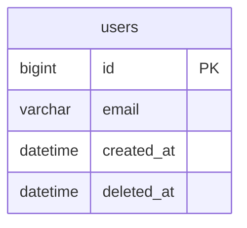

# DATABASE.md — 数据库设计

> 唯一真源：所有 ORM Model 必须与此文档严格一致  
> 维护者：Architect Agent（/db-design 命令）  
> 字段定义是 DATABASE.md 的职责；API 字段是 Pydantic schema 的职责
>
> **双侧持久化**：后端 SQLAlchemy + Alembic 迁移；前端 Drift（SQLite）+ `schemaVersion` 迁移。
> 一次 schema 变更必须在**同一个 commit**同步改 4 处（缺一不可，见 AGENTS.md「schema 4 件套」）：
> 1. 本文档（DATABASE.md）对应表/列
> 2. 后端 Alembic migration（含 downgrade）
> 3. 前端 Drift table 类 + `schemaVersion` bump + `MigrationStrategy` step
> 4. 双侧迁移测试（后端 upgrade/downgrade；前端旧版升级数据保全）

---

## 全局约定（MySQL 8 / InnoDB）

### 引擎与字符集
- 存储引擎统一 `InnoDB`（事务 + 外键）
- 字符集 `utf8mb4`，排序规则 `utf8mb4_0900_ai_ci`（MySQL 8）

### 主键
- 所有表使用 `BIGINT NOT NULL AUTO_INCREMENT PRIMARY KEY`
- 跨端标识用 `sync_id`（见 SYNC_DESIGN），本地自增主键不跨端

### 软删除
- 所有业务表必须有 `deleted_at DATETIME NULL`
- 查询时必须过滤 `WHERE deleted_at IS NULL`
- 永久删除仅在合规要求或数据清理时执行

### 时间戳
- `created_at DATETIME NOT NULL DEFAULT CURRENT_TIMESTAMP`
- `updated_at DATETIME NOT NULL DEFAULT CURRENT_TIMESTAMP ON UPDATE CURRENT_TIMESTAMP`
- MySQL 无时区类型；所有时间统一存 UTC，时区转换在应用层

### 用户隔离
- 所有用户业务表必须有 `user_id BIGINT NOT NULL`，并 `FOREIGN KEY (user_id) REFERENCES users(id) ON DELETE CASCADE`
- InnoDB 会自动为外键列建索引，无需重复手加（高频联合查询可加复合索引）
- 查询时必须过滤 `WHERE user_id = :current_user_id`

### 枚举
- 禁止使用 MySQL 原生 ENUM 类型（改枚举值需 ALTER 重建表，迁移复杂）
- 使用 `VARCHAR(N) NOT NULL CHECK (col IN ('val1','val2',...))`（CHECK 需 MySQL 8.0.16+；旧版退回应用层校验）

### 索引
- 外键列：InnoDB 自动建索引（与 PostgreSQL 不同，无需手加单列索引）
- 高频查询列必须有索引（先分析查询模式再决定）
- 注意 utf8mb4 下被索引 `VARCHAR` 的键长限制（单列索引前缀 ≤ 3072 字节）

### 命名
- 表名：复数蛇形命名，如 `user_profiles`
- 列名：蛇形命名
- 索引名：`idx_{table}_{column}` 或 `idx_{table}_{col1}_{col2}`

---

## ER 图



---

## 表设计

### users

> 状态: 已确认 [YYYY-MM-DD]

**用途：** 系统用户主表，所有用户业务表的 FK 参照

```sql
CREATE TABLE users (
    id         BIGINT       NOT NULL AUTO_INCREMENT PRIMARY KEY,
    email      VARCHAR(255) NOT NULL UNIQUE,
    created_at DATETIME     NOT NULL DEFAULT CURRENT_TIMESTAMP,
    updated_at DATETIME     NOT NULL DEFAULT CURRENT_TIMESTAMP ON UPDATE CURRENT_TIMESTAMP,
    deleted_at DATETIME     NULL
) ENGINE=InnoDB DEFAULT CHARSET=utf8mb4 COLLATE=utf8mb4_0900_ai_ci;
```

| 列 | 类型 | 约束 | 说明 |
|----|------|------|------|
| id | BIGINT | PK AUTO_INCREMENT | 自增主键 |
| email | VARCHAR(255) | NOT NULL UNIQUE | 用户邮箱（登录凭证） |
| created_at | DATETIME | NOT NULL DEFAULT CURRENT_TIMESTAMP | 创建时间（UTC） |
| updated_at | DATETIME | NOT NULL DEFAULT CURRENT_TIMESTAMP ON UPDATE CURRENT_TIMESTAMP | 更新时间（UTC） |
| deleted_at | DATETIME | NULL | 软删除标记 |

**索引：**
- `email` 的 `UNIQUE` 约束已自动建唯一索引（登录查询），无需重复加

---

## 前端 Drift 映射（每张可同步/本地缓存的表都要填）

> 前端用 Drift（SQLite）。后端类型 → Drift 列类型映射，并登记 `schemaVersion` 与迁移 step。

### <table_name>（对应后端同名表）

```dart
// frontend/lib/data/database/tables/<table_name>.dart
class <Table>s extends Table {
  IntColumn    get id        => integer().autoIncrement()();          // BIGINT AUTO_INCREMENT → integer autoIncrement
  TextColumn   get syncId    => text().unique()();                    // sync_id（同步主键，见 SYNC_DESIGN）
  TextColumn   get userId    => text()();                             // user_id
  IntColumn    get amountCents => integer()();                        // 金额用整数分，禁用 float
  DateTimeColumn get createdAt => dateTime()();                       // UTC
  DateTimeColumn get updatedAt => dateTime()();                       // 冲突解决依据
  DateTimeColumn get deletedAt => dateTime().nullable()();            // 软删除 / tombstone
}
```

**类型映射约定：**

| 后端 (MySQL/SQLAlchemy) | 前端 (Drift) | 说明 |
|---|---|---|
| BIGINT AUTO_INCREMENT PK | `integer().autoIncrement()` | 本地自增；跨端标识用 `sync_id` |
| VARCHAR(n) | `text()` | |
| 金额 DECIMAL/整数分 | `integer()` | 一律整数分，禁 float |
| DATETIME (UTC) | `dateTime()`（存 UTC） | |
| 可空 | `.nullable()` | |
| 枚举 VARCHAR+CHECK | `text()` + Dart 侧校验 | SQLite 无 CHECK 强约束，业务层校验 |

**Drift 迁移：**
- 当前 `schemaVersion`：**N**（本次变更需 bump 到 **N+1**）
- `MigrationStrategy.onUpgrade` step：
```dart
if (from < N+1) {
  await m.createTable(<table>s);        // 或 m.addColumn(...) / 数据回填
}
```

---

## Migration 记录

> 后端 Alembic 与前端 Drift 成对登记，确保版本对齐。

| 日期 | 后端 Alembic | 前端 Drift schemaVersion | 内容 | 类型 |
|------|------|------|------|------|
| YYYY-MM-DD | 001_initial | v1 | 初始表结构 | autogenerate |
