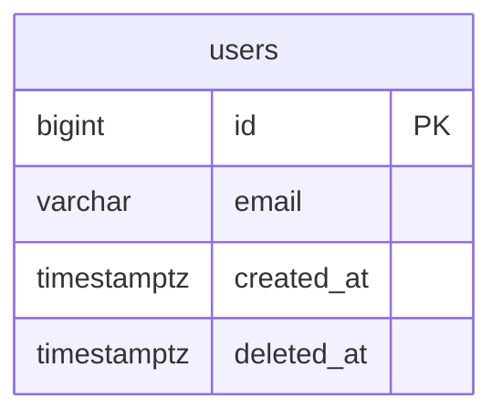

# DATABASE.md — 数据库设计

> 唯一真源：所有 ORM Model 必须与此文档严格一致  
> 维护者：Architect Agent（/db-design 命令）  
> 字段定义是 DATABASE.md 的职责；API 字段是 Pydantic schema 的职责

---

## 全局约定

### 主键
- 所有表使用 `BIGSERIAL PRIMARY KEY`（PostgreSQL 自动递增大整数）

### 软删除
- 所有业务表必须有 `deleted_at TIMESTAMPTZ NULL`
- 查询时必须过滤 `WHERE deleted_at IS NULL`
- 永久删除仅在合规要求或数据清理时执行

### 时间戳
- `created_at TIMESTAMPTZ NOT NULL DEFAULT NOW()`
- `updated_at TIMESTAMPTZ NOT NULL DEFAULT NOW()`（应有触发器或 ORM `onupdate`）
- 所有时间存储为 UTC

### 用户隔离
- 所有用户业务表必须有：`user_id BIGINT NOT NULL REFERENCES users(id) ON DELETE CASCADE`
- `user_id` 列必须有单独索引
- 查询时必须过滤 `WHERE user_id = :current_user_id`

### 枚举
- 禁止使用 PostgreSQL 原生 ENUM 类型（迁移复杂）
- 使用 `VARCHAR(N) NOT NULL CHECK(col IN ('val1', 'val2', ...))`

### 索引
- 所有外键列必须有单独索引（PostgreSQL 不自动创建）
- 高频查询列必须有索引（先分析查询模式再决定）

### 命名
- 表名：复数蛇形命名，如 `user_profiles`
- 列名：蛇形命名
- 索引名：`idx_{table}_{column}` 或 `idx_{table}_{col1}_{col2}`

---

## ER 图



---

## 表设计

### users

> 状态: 已确认 [YYYY-MM-DD]

**用途：** 系统用户主表，所有用户业务表的 FK 参照

```sql
CREATE TABLE users (
    id         BIGSERIAL PRIMARY KEY,
    email      VARCHAR(255) NOT NULL UNIQUE,
    created_at TIMESTAMPTZ  NOT NULL DEFAULT NOW(),
    updated_at TIMESTAMPTZ  NOT NULL DEFAULT NOW(),
    deleted_at TIMESTAMPTZ  NULL
);

CREATE INDEX idx_users_email ON users(email);
```

| 列 | 类型 | 约束 | 说明 |
|----|------|------|------|
| id | BIGSERIAL | PK | 自增主键 |
| email | VARCHAR(255) | NOT NULL UNIQUE | 用户邮箱（登录凭证） |
| created_at | TIMESTAMPTZ | NOT NULL DEFAULT NOW() | 创建时间（UTC） |
| updated_at | TIMESTAMPTZ | NOT NULL DEFAULT NOW() | 更新时间（UTC） |
| deleted_at | TIMESTAMPTZ | NULL | 软删除标记 |

**索引：**
- `idx_users_email` — 登录查询

---

## Migration 记录

| 日期 | 版本 | 内容 | 类型 |
|------|------|------|------|
| YYYY-MM-DD | 001_initial | 初始表结构 | autogenerate |
